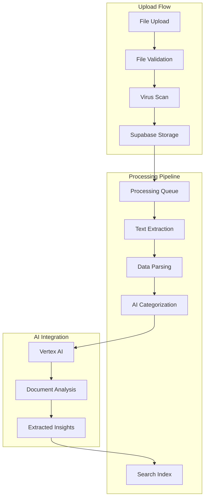

# File Processing Pipeline Specification

## Overview
Comprehensive specification for handling file uploads (PDFs, Pitchdex, CSVs, bank statements) in the financial dashboard, including text extraction, AI analysis, and secure storage.

## Architecture



## Supported File Types

### 1. PDF Documents
**Use Cases:**
- Bank statements
- Invoices
- Tax documents
- Financial reports
- Contracts

**Processing:**
- Text extraction using `pdf-parse` or `pdfjs-dist`
- OCR for scanned documents (using Google Cloud Vision API)
- Table extraction for structured data
- Image extraction for receipts

### 2. Pitchdex Files
**Use Cases:**
- Pitch decks
- Financial presentations
- Business plans

**Processing:**
- Text extraction from slides
- Image analysis for charts/graphs
- Key data point extraction
- Summary generation

### 3. CSV/Excel Files
**Use Cases:**
- Transaction exports
- Bank statement downloads
- Budget spreadsheets
- Investment portfolios

**Processing:**
- Column detection and mapping
- Data type validation
- Currency detection
- Date format normalization

### 4. Bank Statements (OFX/QIF)
**Use Cases:**
- Direct bank exports
- Financial software exports

**Processing:**
- Format parsing (OFX/QIF)
- Transaction extraction
- Account information extraction
- Balance verification

## File Validation

### Validation Rules
```typescript
interface FileValidationRules {
  maxSize: number // 10MB
  allowedTypes: string[]
  allowedExtensions: string[]
  virusScan: boolean
  contentValidation: boolean
}

const VALIDATION_RULES: FileValidationRules = {
  maxSize: 10 * 1024 * 1024, // 10MB
  allowedTypes: [
    'application/pdf',
    'text/csv',
    'application/vnd.ms-excel',
    'application/vnd.openxmlformats-officedocument.spreadsheetml.sheet',
    'application/x-ofx',
    'application/x-qif'
  ],
  allowedExtensions: ['.pdf', '.csv', '.xls', '.xlsx', '.ofx', '.qif'],
  virusScan: true,
  contentValidation: true
}
```

### Validation Implementation
```typescript
async function validateFile(file: File): Promise<ValidationResult> {
  const errors: string[] = []
  
  // Size validation
  if (file.size > VALIDATION_RULES.maxSize) {
    errors.push(`File size exceeds maximum of ${VALIDATION_RULES.maxSize / 1024 / 1024}MB`)
  }
  
  // Type validation
  if (!VALIDATION_RULES.allowedTypes.includes(file.type)) {
    errors.push(`File type ${file.type} is not allowed`)
  }
  
  // Extension validation
  const extension = getFileExtension(file.name)
  if (!VALIDATION_RULES.allowedExtensions.includes(extension)) {
    errors.push(`File extension ${extension} is not allowed`)
  }
  
  // Content validation (magic bytes)
  const isValidContent = await validateFileContent(file)
  if (!isValidContent) {
    errors.push('File content does not match expected format')
  }
  
  return {
    valid: errors.length === 0,
    errors
  }
}
```

## Text Extraction

### PDF Extraction
```typescript
// server/src/services/file-processing/pdf-extractor.ts

import pdf from 'pdf-parse'
import { createWorker } from 'tesseract.js'

export class PDFExtractor {
  async extractText(buffer: Buffer): Promise<ExtractedContent> {
    try {
      // Try text extraction first
      const data = await pdf(buffer)
      
      if (data.text.length > 100) {
        return {
          text: data.text,
          pages: data.numpages,
          metadata: data.metadata,
          type: 'text'
        }
      }
      
      // If little text, try OCR
      return await this.performOCR(buffer)
    } catch (error) {
      throw new ExtractionError('PDF extraction failed', error)
    }
  }
  
  private async performOCR(buffer: Buffer): Promise<ExtractedContent> {
    const worker = await createWorker('eng')
    
    try {
      const { data } = await worker.recognize(buffer)
      
      return {
        text: data.text,
        pages: 1,
        confidence: data.confidence,
        type: 'ocr'
      }
    } finally {
      await worker.terminate()
    }
  }
  
  async extractTables(buffer: Buffer): Promise<Table[]> {
    // Use tabula-py or similar for table extraction
    // This is a simplified version
    const tables: Table[] = []
    
    // Implementation would use specialized PDF table extraction
    // libraries or cloud services
    
    return tables
  }
}
```

### CSV/Excel Extraction
```typescript
// server/src/services/file-processing/csv-extractor.ts

import { parse } from 'csv-parse'
import * as XLSX from 'xlsx'

export class CSVExtractor {
  async extractFromCSV(buffer: Buffer): Promise<ExtractedData> {
    return new Promise((resolve, reject) => {
      const records: any[] = []
      const parser = parse({
        columns: true,
        skip_empty_lines: true,
        trim: true
      })
      
      parser.on('readable', () => {
        let record
        while ((record = parser.read()) !== null) {
          records.push(record)
        }
      })
      
      parser.on('error', reject)
      parser.on('end', () => {
        resolve({
          records,
          columns: Object.keys(records[0] || {}),
          rowCount: records.length
        })
      })
      
      parser.write(buffer.toString())
      parser.end()
    })
  }
  
  async extractFromExcel(buffer: Buffer): Promise<ExtractedData> {
    const workbook = XLSX.read(buffer, { type: 'buffer' })
    const sheetName = workbook.SheetNames[0]
    const sheet = workbook.Sheets[sheetName]
    
    const records = XLSX.utils.sheet_to_json(sheet)
    
    return {
      records,
      columns: Object.keys(records[0] || {}),
      rowCount: records.length,
      sheetNames: workbook.SheetNames
    }
  }
}
```

### Bank Statement Parsing (OFX/QIF)
```typescript
// server/src/services/file-processing/bank-statement-parser.ts

import { OFXParser } from 'ofx-parser'
import { QIFParser } from 'qif-parser'

export class BankStatementParser {
  async parseOFX(buffer: Buffer): Promise<BankStatement> {
    const parser = new OFXParser()
    const ofxData = parser.parse(buffer.toString())
    
    return {
      bankId: ofxData.bankId,
      accountId: ofxData.accountId,
      accountType: ofxData.accountType,
      balance: ofxData.balance,
      transactions: ofxData.transactions.map(tx => ({
        date: new Date(tx.date),
        amount: tx.amount,
        description: tx.memo,
        type: tx.type,
        fitId: tx.fitId
      }))
    }
  }
  
  async parseQIF(buffer: Buffer): Promise<BankStatement> {
    const parser = new QIFParser()
    const qifData = parser.parse(buffer.toString())
    
    return {
      accountType: qifData.accountType,
      transactions: qifData.transactions.map(tx => ({
        date: new Date(tx.date),
        amount: tx.amount,
        description: tx.payee,
        category: tx.category,
        memo: tx.memo
      }))
    }
  }
}
```

## Data Parsing & Categorization

### Transaction Parser
```typescript
// server/src/services/file-processing/transaction-parser.ts

export class TransactionParser {
  async parseTransactions(
    records: any[],
    fileType: FileType,
    userId: string
  ): Promise<ParsedTransaction[]> {
    const transactions: ParsedTransaction[] = []
    
    for (const record of records) {
      const transaction = await this.parseRecord(record, fileType)
      
      if (transaction) {
        // AI categorization
        const category = await this.categorizeTransaction(transaction, userId)
        
        transactions.push({
          ...transaction,
          category,
          confidence: category.confidence
        })
      }
    }
    
    return transactions
  }
  
  private async parseRecord(
    record: any,
    fileType: FileType
  ): Promise<RawTransaction | null> {
    // Map columns based on file type
    const mapping = this.getColumnMapping(fileType)
    
    const date = this.parseDate(record[mapping.date])
    const amount = this.parseAmount(record[mapping.amount])
    const description = record[mapping.description] || ''
    
    if (!date || !amount) {
      return null
    }
    
    return {
      date,
      amount,
      description,
      type: amount > 0 ? 'income' : 'expense',
      currency: this.detectCurrency(record, mapping),
      rawData: record
    }
  }
  
  private async categorizeTransaction(
    transaction: RawTransaction,
    userId: string
  ): Promise<Category> {
    // First, check user's existing categories
    const userCategories = await getUserCategories(userId)
    
    // Try to match based on description
    const matchedCategory = this.matchCategory(
      transaction.description,
      userCategories
    )
    
    if (matchedCategory) {
      return { ...matchedCategory, confidence: 0.9 }
    }
    
    // Use AI for categorization
    const aiCategory = await this.aiCategorize(transaction, userId)
    
    return aiCategory
  }
  
  private async aiCategorize(
    transaction: RawTransaction,
    userId: string
  ): Promise<Category> {
    const prompt = `
Categorize this financial transaction:
Description: ${transaction.description}
Amount: ${transaction.amount}
Type: ${transaction.type}

Available categories: ${(await getUserCategories(userId)).map(c => c.name).join(', ')}

Return the most appropriate category name.
`
    
    const response = await vertexAI.generateResponse(userId, prompt, 'categorization')
    
    return {
      name: response.content.trim(),
      confidence: response.confidence
    }
  }
}
```

## AI Document Analysis

### Document Analyzer
```typescript
// server/src/services/file-processing/document-analyzer.ts

export class DocumentAnalyzer {
  async analyzeDocument(
    extractedContent: ExtractedContent,
    userId: string,
    fileId: string
  ): Promise<DocumentAnalysis> {
    // Build context for AI
    const context = await this.buildDocumentContext(extractedContent, userId)
    
    // Generate analysis
    const analysis = await vertexAI.generateResponse(
      userId,
      `Analyze this financial document and extract key information:\n\n${extractedContent.text}`,
      'document'
    )
    
    // Extract structured data
    const structuredData = await this.extractStructuredData(
      extractedContent,
      analysis
    )
    
    // Store analysis
    await this.storeAnalysis(fileId, analysis, structuredData)
    
    return {
      summary: analysis.content,
      structuredData,
      insights: analysis.suggestions || [],
      actionItems: this.extractActionItems(analysis.content)
    }
  }
  
  private async extractStructuredData(
    content: ExtractedContent,
    analysis: AIResponse
  ): Promise<StructuredData> {
    // Try to extract JSON from AI response
    const jsonMatch = analysis.content.match(/```json\n([\s\S]*?)\n```/)
    
    if (jsonMatch) {
      try {
        return JSON.parse(jsonMatch[1])
      } catch (e) {
        console.warn('Failed to parse structured data')
      }
    }
    
    // Fallback: extract key-value pairs
    return this.extractKeyValues(content.text)
  }
  
  private extractActionItems(text: string): ActionItem[] {
    const actionItems: ActionItem[] = []
    
    // Look for dates and deadlines
    const datePattern = /(\d{1,2}[\/-]\d{1,2}[\/-]\d{2,4}|\w+ \d{1,2}, \d{4})/g
    const dates = text.match(datePattern) || []
    
    // Look for amounts
    const amountPattern = /\$[\d,]+\.?\d*/g
    const amounts = text.match(amountPattern) || []
    
    // Look for action verbs
    const actionVerbs = ['pay', 'submit', 'file', 'deadline', 'due', 'renew']
    const sentences = text.split(/[.!?]+/)
    
    for (const sentence of sentences) {
      if (actionVerbs.some(verb => sentence.toLowerCase().includes(verb))) {
        actionItems.push({
          description: sentence.trim(),
          priority: this.determinePriority(sentence),
          deadline: this.extractDeadline(sentence)
        })
      }
    }
    
    return actionItems
  }
}
```

## Processing Queue

### Queue Implementation
```typescript
// server/src/services/file-processing/processing-queue.ts

import { Queue, Worker, Job } from 'bullmq'
import Redis from 'ioredis'

const connection = new Redis(process.env.REDIS_URL)

export const fileProcessingQueue = new Queue('file-processing', {
  connection,
  defaultJobOptions: {
    attempts: 3,
    backoff: {
      type: 'exponential',
      delay: 1000
    },
    removeOnComplete: 100,
    removeOnFail: 50
  }
})

interface FileProcessingJob {
  fileId: string
  userId: string
  filePath: string
  fileType: string
  fileName: string
}

const worker = new Worker(
  'file-processing',
  async (job: Job<FileProcessingJob>) => {
    const { fileId, userId, filePath, fileType, fileName } = job.data
    
    try {
      // Update status
      await updateFileStatus(fileId, 'processing')
      
      // Download file from storage
      const buffer = await downloadFile(filePath)
      
      // Extract text
      const extractedContent = await extractText(buffer, fileType)
      
      // Parse data
      const parsedData = await parseData(extractedContent, fileType)
      
      // AI analysis
      const analysis = await analyzeDocument(extractedContent, userId, fileId)
      
      // Store results
      await storeProcessingResults(fileId, {
        extractedText: extractedContent.text,
        parsedData,
        analysis
      })
      
      // Update status
      await updateFileStatus(fileId, 'completed')
      
      return { success: true, fileId }
    } catch (error) {
      await updateFileStatus(fileId, 'failed', error.message)
      throw error
    }
  },
  { connection }
)

// Event handlers
worker.on('completed', (job) => {
  console.log(`Job ${job.id} completed`)
})

worker.on('failed', (job, error) => {
  console.error(`Job ${job?.id} failed:`, error)
})
```

## Storage Strategy

### Supabase Storage Configuration
```typescript
// server/src/services/file-processing/storage.ts

import { createClient } from '@supabase/supabase-js'

const supabase = createClient(
  process.env.SUPABASE_URL!,
  process.env.SUPABASE_SERVICE_ROLE_KEY!
)

export class FileStorage {
  private bucket = 'financial-documents'
  
  async uploadFile(
    userId: string,
    file: File,
    fileName: string
  ): Promise<UploadResult> {
    const filePath = `${userId}/${Date.now()}-${fileName}`
    
    const { data, error } = await supabase.storage
      .from(this.bucket)
      .upload(filePath, file)
    
    if (error) {
      throw new StorageError('Upload failed', error)
    }
    
    // Get public URL
    const { data: urlData } = supabase.storage
      .from(this.bucket)
      .getPublicUrl(filePath)
    
    return {
      path: filePath,
      url: urlData.publicUrl,
      size: file.size
    }
  }
  
  async downloadFile(filePath: string): Promise<Buffer> {
    const { data, error } = await supabase.storage
      .from(this.bucket)
      .download(filePath)
    
    if (error) {
      throw new StorageError('Download failed', error)
    }
    
    return Buffer.from(await data.arrayBuffer())
  }
  
  async deleteFile(filePath: string): Promise<void> {
    const { error } = await supabase.storage
      .from(this.bucket)
      .remove([filePath])
    
    if (error) {
      throw new StorageError('Delete failed', error)
    }
  }
  
  async listUserFiles(userId: string): Promise<FileInfo[]> {
    const { data, error } = await supabase.storage
      .from(this.bucket)
      .list(userId)
    
    if (error) {
      throw new StorageError('List failed', error)
    }
    
    return data.map(file => ({
      name: file.name,
      size: file.metadata.size,
      createdAt: file.created_at,
      updatedAt: file.updated_at
    }))
  }
}
```

## Search & Indexing

### Full-Text Search
```typescript
// server/src/services/file-processing/search-index.ts

export class SearchIndex {
  async indexDocument(
    fileId: string,
    content: ExtractedContent,
    metadata: FileMetadata
  ): Promise<void> {
    // Store in search index table
    await supabase.from('file_search_index').upsert({
      file_id: fileId,
      content: content.text,
      metadata: JSON.stringify(metadata),
      tokens: this.tokenize(content.text),
      created_at: new Date().toISOString()
    })
  }
  
  async search(
    userId: string,
    query: string,
    limit: number = 10
  ): Promise<SearchResult[]> {
    // Use PostgreSQL full-text search
    const { data, error } = await supabase
      .from('file_search_index')
      .select(`
        file_id,
        metadata,
        ts_rank(to_tsvector('english', content), plainto_tsquery('english', ${query})) as rank
      `)
      .eq('user_id', userId)
      .textSearch('content', query)
      .order('rank', { ascending: false })
      .limit(limit)
    
    if (error) {
      throw new SearchError('Search failed', error)
    }
    
    return data
  }
  
  private tokenize(text: string): string[] {
    // Simple tokenization
    return text
      .toLowerCase()
      .replace(/[^\w\s]/g, '')
      .split(/\s+/)
      .filter(token => token.length > 2)
  }
}
```

## Error Handling

### Error Types
```typescript
enum FileProcessingErrorType {
  VALIDATION_ERROR = 'VALIDATION_ERROR',
  EXTRACTION_ERROR = 'EXTRACTION_ERROR',
  PARSING_ERROR = 'PARSING_ERROR',
  STORAGE_ERROR = 'STORAGE_ERROR',
  AI_ANALYSIS_ERROR = 'AI_ANALYSIS_ERROR',
  VIRUS_DETECTED = 'VIRUS_DETECTED'
}

class FileProcessingError extends Error {
  constructor(
    public type: FileProcessingErrorType,
    message: string,
    public details?: any
  ) {
    super(message)
    this.name = 'FileProcessingError'
  }
}
```

### Error Recovery
```typescript
async function handleProcessingError(
  error: FileProcessingError,
  fileId: string
): Promise<void> {
  // Log error
  console.error(`File processing error for ${fileId}:`, error)
  
  // Update file status
  await updateFileStatus(fileId, 'failed', error.message)
  
  // Notify user
  await notifyUser(fileId, error)
  
  // Store error for debugging
  await supabase.from('file_processing_errors').insert({
    file_id: fileId,
    error_type: error.type,
    error_message: error.message,
    error_details: error.details,
    created_at: new Date().toISOString()
  })
}
```

## Security Considerations

### Virus Scanning
```typescript
// server/src/services/file-processing/virus-scanner.ts

import ClamAV from 'clamav.js'

export class VirusScanner {
  private clamav: ClamAV
  
  constructor() {
    this.clamav = new ClamAV()
  }
  
  async scanFile(buffer: Buffer): Promise<ScanResult> {
    try {
      const result = await this.clamav.scanBuffer(buffer)
      
      return {
        clean: result.isClean,
        threats: result.viruses,
        scannedAt: new Date()
      }
    } catch (error) {
      // If scanner fails, reject file as precaution
      throw new VirusScanError('Virus scan failed', error)
    }
  }
}
```

### Data Privacy
1. **Encryption at Rest**: All files encrypted in Supabase Storage
2. **Access Control**: Users can only access their own files
3. **Temporary Files**: Deleted immediately after processing
4. **Audit Logging**: All file operations logged
5. **Data Retention**: Files retained for 7 years (configurable)

## Performance Optimization

### Parallel Processing
```typescript
async function processMultipleFiles(
  files: File[],
  userId: string
): Promise<ProcessingResult[]> {
  const promises = files.map(file => processFile(file, userId))
  
  // Process in parallel with concurrency limit
  const results = await Promise.allSettled(promises)
  
  return results.map((result, index) => ({
    file: files[index],
    success: result.status === 'fulfilled',
    data: result.status === 'fulfilled' ? result.value : null,
    error: result.status === 'rejected' ? result.reason : null
  }))
}
```

### Caching
```typescript
const extractionCache = new Map<string, ExtractedContent>()

async function extractWithCache(
  buffer: Buffer,
  fileType: string
): Promise<ExtractedContent> {
  const cacheKey = `${fileType}-${hashBuffer(buffer)}`
  
  if (extractionCache.has(cacheKey)) {
    return extractionCache.get(cacheKey)!
  }
  
  const content = await extractText(buffer, fileType)
  extractionCache.set(cacheKey, content)
  
  return content
}
```

## Monitoring & Metrics

### Key Metrics
- Upload success rate
- Processing time by file type
- Extraction accuracy
- AI analysis confidence
- Error rate by error type
- Storage usage per user

### Alerts
- High error rate (>5%)
- Slow processing (>30s)
- Storage quota exceeded
- Virus detection

---

**Status**: Draft
**Last Updated**: 2026-03-22
**Next Review**: Before implementation begins

## Overview
Comprehensive specification for handling file uploads (PDFs, Pitchdex, CSVs, bank statements) in the financial dashboard, including text extraction, AI analysis, and secure storage.

## Architecture


## Supported File Types

### 1. PDF Documents
**Use Cases:**
- Bank statements
- Invoices
- Tax documents
- Financial reports
- Contracts

**Processing:**
- Text extraction using `pdf-parse` or `pdfjs-dist`
- OCR for scanned documents (using Google Cloud Vision API)
- Table extraction for structured data
- Image extraction for receipts

### 2. Pitchdex Files
**Use Cases:**
- Pitch decks
- Financial presentations
- Business plans

**Processing:**
- Text extraction from slides
- Image analysis for charts/graphs
- Key data point extraction
- Summary generation

### 3. CSV/Excel Files
**Use Cases:**
- Transaction exports
- Bank statement downloads
- Budget spreadsheets
- Investment portfolios

**Processing:**
- Column detection and mapping
- Data type validation
- Currency detection
- Date format normalization

### 4. Bank Statements (OFX/QIF)
**Use Cases:**
- Direct bank exports
- Financial software exports

**Processing:**
- Format parsing (OFX/QIF)
- Transaction extraction
- Account information extraction
- Balance verification

## File Validation

### Validation Rules
```typescript
interface FileValidationRules {
  maxSize: number // 10MB
  allowedTypes: string[]
  allowedExtensions: string[]
  virusScan: boolean
  contentValidation: boolean
}

const VALIDATION_RULES: FileValidationRules = {
  maxSize: 10 * 1024 * 1024, // 10MB
  allowedTypes: [
    'application/pdf',
    'text/csv',
    'application/vnd.ms-excel',
    'application/vnd.openxmlformats-officedocument.spreadsheetml.sheet',
    'application/x-ofx',
    'application/x-qif'
  ],
  allowedExtensions: ['.pdf', '.csv', '.xls', '.xlsx', '.ofx', '.qif'],
  virusScan: true,
  contentValidation: true
}
```

### Validation Implementation
```typescript
async function validateFile(file: File): Promise<ValidationResult> {
  const errors: string[] = []
  
  // Size validation
  if (file.size > VALIDATION_RULES.maxSize) {
    errors.push(`File size exceeds maximum of ${VALIDATION_RULES.maxSize / 1024 / 1024}MB`)
  }
  
  // Type validation
  if (!VALIDATION_RULES.allowedTypes.includes(file.type)) {
    errors.push(`File type ${file.type} is not allowed`)
  }
  
  // Extension validation
  const extension = getFileExtension(file.name)
  if (!VALIDATION_RULES.allowedExtensions.includes(extension)) {
    errors.push(`File extension ${extension} is not allowed`)
  }
  
  // Content validation (magic bytes)
  const isValidContent = await validateFileContent(file)
  if (!isValidContent) {
    errors.push('File content does not match expected format')
  }
  
  return {
    valid: errors.length === 0,
    errors
  }
}
```

## Text Extraction

### PDF Extraction
```typescript
// server/src/services/file-processing/pdf-extractor.ts

import pdf from 'pdf-parse'
import { createWorker } from 'tesseract.js'

export class PDFExtractor {
  async extractText(buffer: Buffer): Promise<ExtractedContent> {
    try {
      // Try text extraction first
      const data = await pdf(buffer)
      
      if (data.text.length > 100) {
        return {
          text: data.text,
          pages: data.numpages,
          metadata: data.metadata,
          type: 'text'
        }
      }
      
      // If little text, try OCR
      return await this.performOCR(buffer)
    } catch (error) {
      throw new ExtractionError('PDF extraction failed', error)
    }
  }
  
  private async performOCR(buffer: Buffer): Promise<ExtractedContent> {
    const worker = await createWorker('eng')
    
    try {
      const { data } = await worker.recognize(buffer)
      
      return {
        text: data.text,
        pages: 1,
        confidence: data.confidence,
        type: 'ocr'
      }
    } finally {
      await worker.terminate()
    }
  }
  
  async extractTables(buffer: Buffer): Promise<Table[]> {
    // Use tabula-py or similar for table extraction
    // This is a simplified version
    const tables: Table[] = []
    
    // Implementation would use specialized PDF table extraction
    // libraries or cloud services
    
    return tables
  }
}
```

### CSV/Excel Extraction
```typescript
// server/src/services/file-processing/csv-extractor.ts

import { parse } from 'csv-parse'
import * as XLSX from 'xlsx'

export class CSVExtractor {
  async extractFromCSV(buffer: Buffer): Promise<ExtractedData> {
    return new Promise((resolve, reject) => {
      const records: any[] = []
      const parser = parse({
        columns: true,
        skip_empty_lines: true,
        trim: true
      })
      
      parser.on('readable', () => {
        let record
        while ((record = parser.read()) !== null) {
          records.push(record)
        }
      })
      
      parser.on('error', reject)
      parser.on('end', () => {
        resolve({
          records,
          columns: Object.keys(records[0] || {}),
          rowCount: records.length
        })
      })
      
      parser.write(buffer.toString())
      parser.end()
    })
  }
  
  async extractFromExcel(buffer: Buffer): Promise<ExtractedData> {
    const workbook = XLSX.read(buffer, { type: 'buffer' })
    const sheetName = workbook.SheetNames[0]
    const sheet = workbook.Sheets[sheetName]
    
    const records = XLSX.utils.sheet_to_json(sheet)
    
    return {
      records,
      columns: Object.keys(records[0] || {}),
      rowCount: records.length,
      sheetNames: workbook.SheetNames
    }
  }
}
```

### Bank Statement Parsing (OFX/QIF)
```typescript
// server/src/services/file-processing/bank-statement-parser.ts

import { OFXParser } from 'ofx-parser'
import { QIFParser } from 'qif-parser'

export class BankStatementParser {
  async parseOFX(buffer: Buffer): Promise<BankStatement> {
    const parser = new OFXParser()
    const ofxData = parser.parse(buffer.toString())
    
    return {
      bankId: ofxData.bankId,
      accountId: ofxData.accountId,
      accountType: ofxData.accountType,
      balance: ofxData.balance,
      transactions: ofxData.transactions.map(tx => ({
        date: new Date(tx.date),
        amount: tx.amount,
        description: tx.memo,
        type: tx.type,
        fitId: tx.fitId
      }))
    }
  }
  
  async parseQIF(buffer: Buffer): Promise<BankStatement> {
    const parser = new QIFParser()
    const qifData = parser.parse(buffer.toString())
    
    return {
      accountType: qifData.accountType,
      transactions: qifData.transactions.map(tx => ({
        date: new Date(tx.date),
        amount: tx.amount,
        description: tx.payee,
        category: tx.category,
        memo: tx.memo
      }))
    }
  }
}
```

## Data Parsing & Categorization

### Transaction Parser
```typescript
// server/src/services/file-processing/transaction-parser.ts

export class TransactionParser {
  async parseTransactions(
    records: any[],
    fileType: FileType,
    userId: string
  ): Promise<ParsedTransaction[]> {
    const transactions: ParsedTransaction[] = []
    
    for (const record of records) {
      const transaction = await this.parseRecord(record, fileType)
      
      if (transaction) {
        // AI categorization
        const category = await this.categorizeTransaction(transaction, userId)
        
        transactions.push({
          ...transaction,
          category,
          confidence: category.confidence
        })
      }
    }
    
    return transactions
  }
  
  private async parseRecord(
    record: any,
    fileType: FileType
  ): Promise<RawTransaction | null> {
    // Map columns based on file type
    const mapping = this.getColumnMapping(fileType)
    
    const date = this.parseDate(record[mapping.date])
    const amount = this.parseAmount(record[mapping.amount])
    const description = record[mapping.description] || ''
    
    if (!date || !amount) {
      return null
    }
    
    return {
      date,
      amount,
      description,
      type: amount > 0 ? 'income' : 'expense',
      currency: this.detectCurrency(record, mapping),
      rawData: record
    }
  }
  
  private async categorizeTransaction(
    transaction: RawTransaction,
    userId: string
  ): Promise<Category> {
    // First, check user's existing categories
    const userCategories = await getUserCategories(userId)
    
    // Try to match based on description
    const matchedCategory = this.matchCategory(
      transaction.description,
      userCategories
    )
    
    if (matchedCategory) {
      return { ...matchedCategory, confidence: 0.9 }
    }
    
    // Use AI for categorization
    const aiCategory = await this.aiCategorize(transaction, userId)
    
    return aiCategory
  }
  
  private async aiCategorize(
    transaction: RawTransaction,
    userId: string
  ): Promise<Category> {
    const prompt = `
Categorize this financial transaction:
Description: ${transaction.description}
Amount: ${transaction.amount}
Type: ${transaction.type}

Available categories: ${(await getUserCategories(userId)).map(c => c.name).join(', ')}

Return the most appropriate category name.
`
    
    const response = await vertexAI.generateResponse(userId, prompt, 'categorization')
    
    return {
      name: response.content.trim(),
      confidence: response.confidence
    }
  }
}
```

## AI Document Analysis

### Document Analyzer
```typescript
// server/src/services/file-processing/document-analyzer.ts

export class DocumentAnalyzer {
  async analyzeDocument(
    extractedContent: ExtractedContent,
    userId: string,
    fileId: string
  ): Promise<DocumentAnalysis> {
    // Build context for AI
    const context = await this.buildDocumentContext(extractedContent, userId)
    
    // Generate analysis
    const analysis = await vertexAI.generateResponse(
      userId,
      `Analyze this financial document and extract key information:\n\n${extractedContent.text}`,
      'document'
    )
    
    // Extract structured data
    const structuredData = await this.extractStructuredData(
      extractedContent,
      analysis
    )
    
    // Store analysis
    await this.storeAnalysis(fileId, analysis, structuredData)
    
    return {
      summary: analysis.content,
      structuredData,
      insights: analysis.suggestions || [],
      actionItems: this.extractActionItems(analysis.content)
    }
  }
  
  private async extractStructuredData(
    content: ExtractedContent,
    analysis: AIResponse
  ): Promise<StructuredData> {
    // Try to extract JSON from AI response
    const jsonMatch = analysis.content.match(/```json\n([\s\S]*?)\n```/)
    
    if (jsonMatch) {
      try {
        return JSON.parse(jsonMatch[1])
      } catch (e) {
        console.warn('Failed to parse structured data')
      }
    }
    
    // Fallback: extract key-value pairs
    return this.extractKeyValues(content.text)
  }
  
  private extractActionItems(text: string): ActionItem[] {
    const actionItems: ActionItem[] = []
    
    // Look for dates and deadlines
    const datePattern = /(\d{1,2}[\/-]\d{1,2}[\/-]\d{2,4}|\w+ \d{1,2}, \d{4})/g
    const dates = text.match(datePattern) || []
    
    // Look for amounts
    const amountPattern = /\$[\d,]+\.?\d*/g
    const amounts = text.match(amountPattern) || []
    
    // Look for action verbs
    const actionVerbs = ['pay', 'submit', 'file', 'deadline', 'due', 'renew']
    const sentences = text.split(/[.!?]+/)
    
    for (const sentence of sentences) {
      if (actionVerbs.some(verb => sentence.toLowerCase().includes(verb))) {
        actionItems.push({
          description: sentence.trim(),
          priority: this.determinePriority(sentence),
          deadline: this.extractDeadline(sentence)
        })
      }
    }
    
    return actionItems
  }
}
```

## Processing Queue

### Queue Implementation
```typescript
// server/src/services/file-processing/processing-queue.ts

import { Queue, Worker, Job } from 'bullmq'
import Redis from 'ioredis'

const connection = new Redis(process.env.REDIS_URL)

export const fileProcessingQueue = new Queue('file-processing', {
  connection,
  defaultJobOptions: {
    attempts: 3,
    backoff: {
      type: 'exponential',
      delay: 1000
    },
    removeOnComplete: 100,
    removeOnFail: 50
  }
})

interface FileProcessingJob {
  fileId: string
  userId: string
  filePath: string
  fileType: string
  fileName: string
}

const worker = new Worker(
  'file-processing',
  async (job: Job<FileProcessingJob>) => {
    const { fileId, userId, filePath, fileType, fileName } = job.data
    
    try {
      // Update status
      await updateFileStatus(fileId, 'processing')
      
      // Download file from storage
      const buffer = await downloadFile(filePath)
      
      // Extract text
      const extractedContent = await extractText(buffer, fileType)
      
      // Parse data
      const parsedData = await parseData(extractedContent, fileType)
      
      // AI analysis
      const analysis = await analyzeDocument(extractedContent, userId, fileId)
      
      // Store results
      await storeProcessingResults(fileId, {
        extractedText: extractedContent.text,
        parsedData,
        analysis
      })
      
      // Update status
      await updateFileStatus(fileId, 'completed')
      
      return { success: true, fileId }
    } catch (error) {
      await updateFileStatus(fileId, 'failed', error.message)
      throw error
    }
  },
  { connection }
)

// Event handlers
worker.on('completed', (job) => {
  console.log(`Job ${job.id} completed`)
})

worker.on('failed', (job, error) => {
  console.error(`Job ${job?.id} failed:`, error)
})
```

## Storage Strategy

### Supabase Storage Configuration
```typescript
// server/src/services/file-processing/storage.ts

import { createClient } from '@supabase/supabase-js'

const supabase = createClient(
  process.env.SUPABASE_URL!,
  process.env.SUPABASE_SERVICE_ROLE_KEY!
)

export class FileStorage {
  private bucket = 'financial-documents'
  
  async uploadFile(
    userId: string,
    file: File,
    fileName: string
  ): Promise<UploadResult> {
    const filePath = `${userId}/${Date.now()}-${fileName}`
    
    const { data, error } = await supabase.storage
      .from(this.bucket)
      .upload(filePath, file)
    
    if (error) {
      throw new StorageError('Upload failed', error)
    }
    
    // Get public URL
    const { data: urlData } = supabase.storage
      .from(this.bucket)
      .getPublicUrl(filePath)
    
    return {
      path: filePath,
      url: urlData.publicUrl,
      size: file.size
    }
  }
  
  async downloadFile(filePath: string): Promise<Buffer> {
    const { data, error } = await supabase.storage
      .from(this.bucket)
      .download(filePath)
    
    if (error) {
      throw new StorageError('Download failed', error)
    }
    
    return Buffer.from(await data.arrayBuffer())
  }
  
  async deleteFile(filePath: string): Promise<void> {
    const { error } = await supabase.storage
      .from(this.bucket)
      .remove([filePath])
    
    if (error) {
      throw new StorageError('Delete failed', error)
    }
  }
  
  async listUserFiles(userId: string): Promise<FileInfo[]> {
    const { data, error } = await supabase.storage
      .from(this.bucket)
      .list(userId)
    
    if (error) {
      throw new StorageError('List failed', error)
    }
    
    return data.map(file => ({
      name: file.name,
      size: file.metadata.size,
      createdAt: file.created_at,
      updatedAt: file.updated_at
    }))
  }
}
```

## Search & Indexing

### Full-Text Search
```typescript
// server/src/services/file-processing/search-index.ts

export class SearchIndex {
  async indexDocument(
    fileId: string,
    content: ExtractedContent,
    metadata: FileMetadata
  ): Promise<void> {
    // Store in search index table
    await supabase.from('file_search_index').upsert({
      file_id: fileId,
      content: content.text,
      metadata: JSON.stringify(metadata),
      tokens: this.tokenize(content.text),
      created_at: new Date().toISOString()
    })
  }
  
  async search(
    userId: string,
    query: string,
    limit: number = 10
  ): Promise<SearchResult[]> {
    // Use PostgreSQL full-text search
    const { data, error } = await supabase
      .from('file_search_index')
      .select(`
        file_id,
        metadata,
        ts_rank(to_tsvector('english', content), plainto_tsquery('english', ${query})) as rank
      `)
      .eq('user_id', userId)
      .textSearch('content', query)
      .order('rank', { ascending: false })
      .limit(limit)
    
    if (error) {
      throw new SearchError('Search failed', error)
    }
    
    return data
  }
  
  private tokenize(text: string): string[] {
    // Simple tokenization
    return text
      .toLowerCase()
      .replace(/[^\w\s]/g, '')
      .split(/\s+/)
      .filter(token => token.length > 2)
  }
}
```

## Error Handling

### Error Types
```typescript
enum FileProcessingErrorType {
  VALIDATION_ERROR = 'VALIDATION_ERROR',
  EXTRACTION_ERROR = 'EXTRACTION_ERROR',
  PARSING_ERROR = 'PARSING_ERROR',
  STORAGE_ERROR = 'STORAGE_ERROR',
  AI_ANALYSIS_ERROR = 'AI_ANALYSIS_ERROR',
  VIRUS_DETECTED = 'VIRUS_DETECTED'
}

class FileProcessingError extends Error {
  constructor(
    public type: FileProcessingErrorType,
    message: string,
    public details?: any
  ) {
    super(message)
    this.name = 'FileProcessingError'
  }
}
```

### Error Recovery
```typescript
async function handleProcessingError(
  error: FileProcessingError,
  fileId: string
): Promise<void> {
  // Log error
  console.error(`File processing error for ${fileId}:`, error)
  
  // Update file status
  await updateFileStatus(fileId, 'failed', error.message)
  
  // Notify user
  await notifyUser(fileId, error)
  
  // Store error for debugging
  await supabase.from('file_processing_errors').insert({
    file_id: fileId,
    error_type: error.type,
    error_message: error.message,
    error_details: error.details,
    created_at: new Date().toISOString()
  })
}
```

## Security Considerations

### Virus Scanning
```typescript
// server/src/services/file-processing/virus-scanner.ts

import ClamAV from 'clamav.js'

export class VirusScanner {
  private clamav: ClamAV
  
  constructor() {
    this.clamav = new ClamAV()
  }
  
  async scanFile(buffer: Buffer): Promise<ScanResult> {
    try {
      const result = await this.clamav.scanBuffer(buffer)
      
      return {
        clean: result.isClean,
        threats: result.viruses,
        scannedAt: new Date()
      }
    } catch (error) {
      // If scanner fails, reject file as precaution
      throw new VirusScanError('Virus scan failed', error)
    }
  }
}
```

### Data Privacy
1. **Encryption at Rest**: All files encrypted in Supabase Storage
2. **Access Control**: Users can only access their own files
3. **Temporary Files**: Deleted immediately after processing
4. **Audit Logging**: All file operations logged
5. **Data Retention**: Files retained for 7 years (configurable)

## Performance Optimization

### Parallel Processing
```typescript
async function processMultipleFiles(
  files: File[],
  userId: string
): Promise<ProcessingResult[]> {
  const promises = files.map(file => processFile(file, userId))
  
  // Process in parallel with concurrency limit
  const results = await Promise.allSettled(promises)
  
  return results.map((result, index) => ({
    file: files[index],
    success: result.status === 'fulfilled',
    data: result.status === 'fulfilled' ? result.value : null,
    error: result.status === 'rejected' ? result.reason : null
  }))
}
```

### Caching
```typescript
const extractionCache = new Map<string, ExtractedContent>()

async function extractWithCache(
  buffer: Buffer,
  fileType: string
): Promise<ExtractedContent> {
  const cacheKey = `${fileType}-${hashBuffer(buffer)}`
  
  if (extractionCache.has(cacheKey)) {
    return extractionCache.get(cacheKey)!
  }
  
  const content = await extractText(buffer, fileType)
  extractionCache.set(cacheKey, content)
  
  return content
}
```

## Monitoring & Metrics

### Key Metrics
- Upload success rate
- Processing time by file type
- Extraction accuracy
- AI analysis confidence
- Error rate by error type
- Storage usage per user

### Alerts
- High error rate (>5%)
- Slow processing (>30s)
- Storage quota exceeded
- Virus detection

---

**Status**: Draft
**Last Updated**: 2026-03-22
**Next Review**: Before implementation begins

