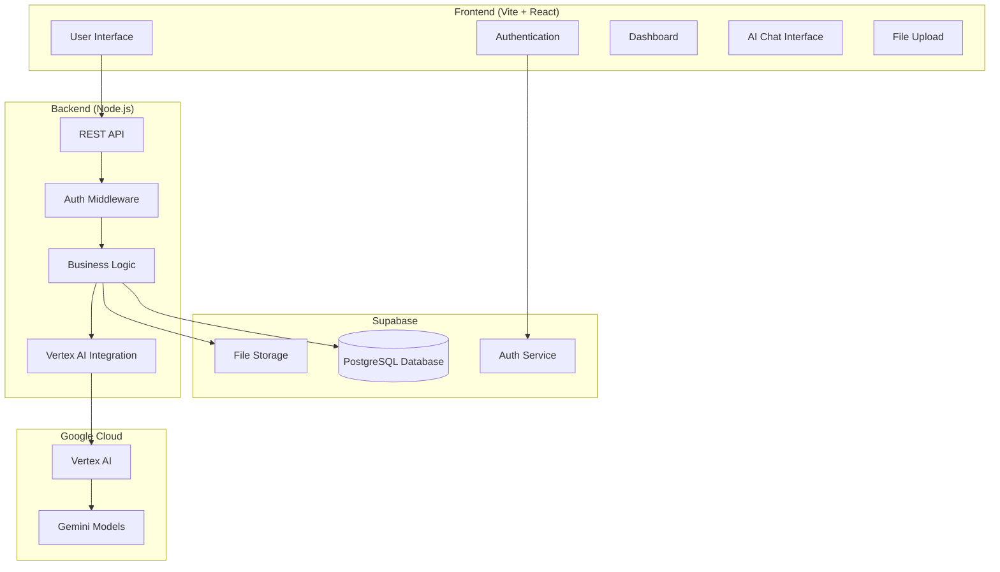
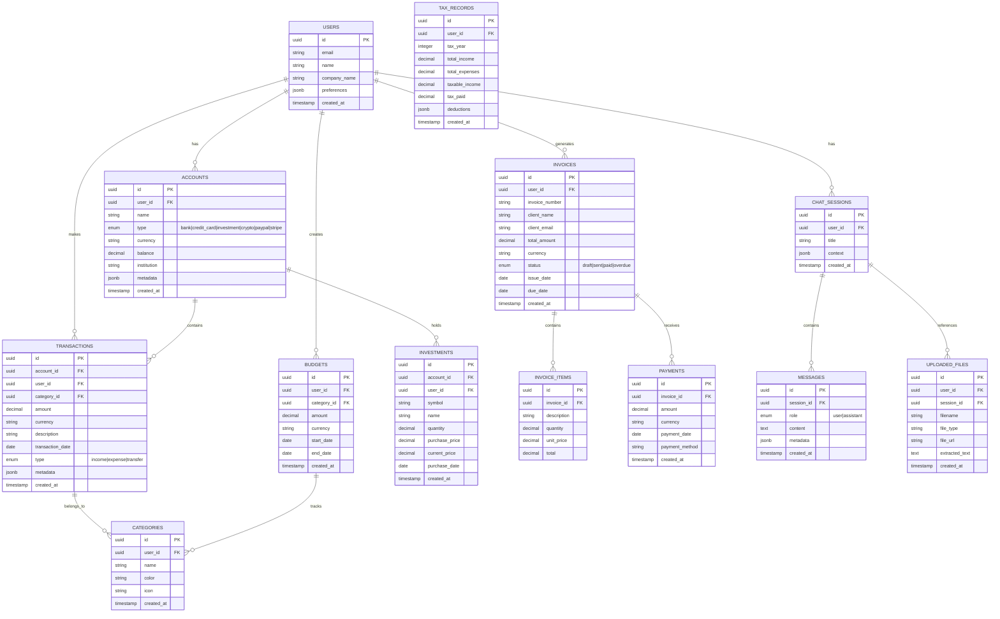
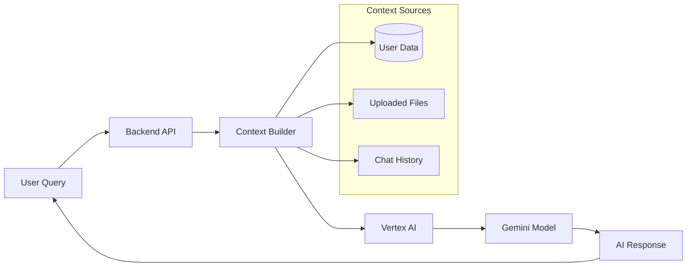
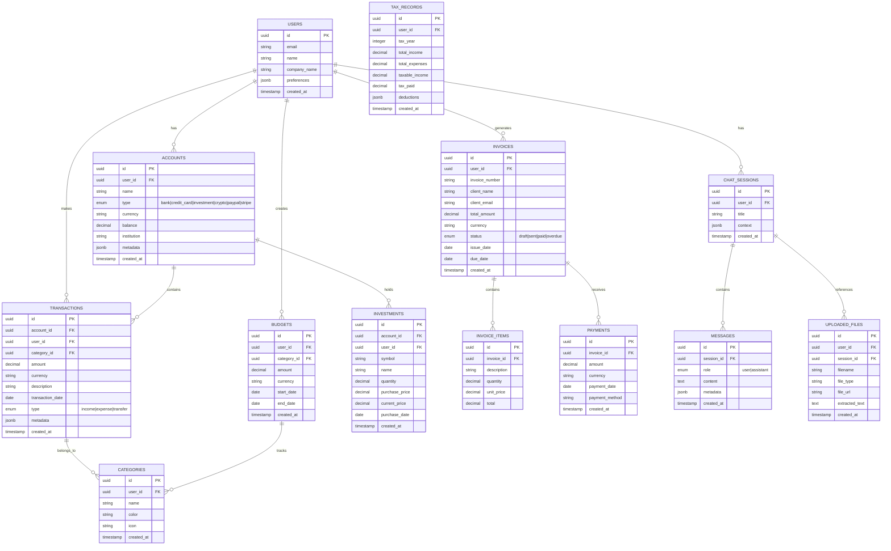

# Financial Dashboard Architecture Plan

## Project Overview

A personalized financial dashboard powered by Vertex AI for internal use by the founder and co-founder. The system will track multiple account types, provide AI-driven insights, and offer comprehensive financial management features.

## Technology Stack

### Frontend
- **Framework**: Vite + React 18 + TypeScript
- **Package Manager**: Bun
- **UI Library**: Tailwind CSS + Shadcn/ui
- **State Management**: Zustand
- **Data Fetching**: TanStack Query (React Query)
- **Charts**: Recharts or Chart.js
- **Forms**: React Hook Form + Zod validation

### Backend
- **Runtime**: Node.js with Express/Fastify
- **Database**: Supabase (PostgreSQL)
- **Authentication**: Supabase Auth (Email/Password + Google OAuth)
- **File Storage**: Supabase Storage
- **API**: RESTful API with TypeScript

### AI & Cloud
- **AI Platform**: Google Cloud Vertex AI
- **Models**: Gemini 2.5 Pro or Flash
- **Deployment**: Vercel
- **Domain**: Custom domain

## System Architecture



## Database Schema Design

### Core Tables



## Feature Modules

### 1. Onboarding Flow
- Welcome screen with company branding
- Account setup (personal/business)
- Initial account connection
- Currency preferences
- AI introduction and capabilities overview

### 2. Account Management
- Multiple account types support
- Real-time balance tracking
- Account categorization
- Multi-currency support with conversion
- Account linking and grouping

### 3. Transaction Management
- Manual transaction entry
- Bulk import (CSV, bank statements)
- Automatic categorization (AI-powered)
- Transaction search and filtering
- Recurring transaction detection

### 4. Budget Planning
- Category-based budgets
- Monthly/quarterly/annual budgets
- Budget vs actual comparison
- Overspending alerts
- Budget recommendations (AI)

### 5. Investment Portfolio
- Portfolio overview and performance
- Asset allocation visualization
- Gain/loss tracking
- Investment recommendations (AI)
- Market data integration

### 6. Invoice Management
- Invoice creation and customization
- Client management
- Payment tracking
- Overdue reminders
- Revenue forecasting

### 7. Tax Reporting
- Income/expense summaries
- Tax category mapping
- Deduction tracking
- Tax liability estimation
- Export for tax software

### 8. AI Chat Interface
- Context-aware conversations
- Financial insights and recommendations
- Natural language queries
- File analysis (PDFs, Pitchdex)
- Personalized advice based on user data

### 9. Analytics Dashboard
- Financial health score
- Cash flow projections
- Spending patterns
- Income trends
- Custom reports

## Vertex AI Integration

### Architecture


### Implementation Strategy
1. **Context Building**: Aggregate user's financial data, transaction history, and uploaded files
2. **Prompt Engineering**: Create specialized prompts for financial analysis
3. **Model Selection**: Use Gemini 2.5 Pro for complex analysis, Flash for quick queries
4. **Response Processing**: Parse and format AI responses for the UI
5. **Learning**: Track user preferences and feedback to improve recommendations

### AI Capabilities
- Financial health assessment
- Spending pattern analysis
- Budget optimization suggestions
- Investment recommendations
- Tax optimization strategies
- Cash flow forecasting
- Anomaly detection
- Document analysis and extraction

## Security Considerations

### Authentication & Authorization
- Supabase Auth with email/password and Google OAuth
- JWT token-based authentication
- Row-level security (RLS) in Supabase
- Role-based access control (owner vs co-founder)

### Data Protection
- Encrypted data at rest (Supabase)
- HTTPS/TLS for all communications
- API rate limiting
- Input validation and sanitization
- SQL injection prevention (parameterized queries)

### Privacy
- Data isolation per user
- Secure file upload handling
- AI data processing transparency
- Audit logging for sensitive operations

## API Design

### RESTful Endpoints

```
Authentication:
POST   /api/auth/register
POST   /api/auth/login
POST   /api/auth/logout
GET    /api/auth/me

Accounts:
GET    /api/accounts
POST   /api/accounts
GET    /api/accounts/:id
PUT    /api/accounts/:id
DELETE /api/accounts/:id

Transactions:
GET    /api/transactions
POST   /api/transactions
GET    /api/transactions/:id
PUT    /api/transactions/:id
DELETE /api/transactions/:id
POST   /api/transactions/import

Categories:
GET    /api/categories
POST   /api/categories
PUT    /api/categories/:id
DELETE /api/categories/:id

Budgets:
GET    /api/budgets
POST   /api/budgets
GET    /api/budgets/:id
PUT    /api/budgets/:id
DELETE /api/budgets/:id

Investments:
GET    /api/investments
POST   /api/investments
GET    /api/investments/:id
PUT    /api/investments/:id
DELETE /api/investments/:id

Invoices:
GET    /api/invoices
POST   /api/invoices
GET    /api/invoices/:id
PUT    /api/invoices/:id
DELETE /api/invoices/:id
POST   /api/invoices/:id/send

Chat:
GET    /api/chat/sessions
POST   /api/chat/sessions
GET    /api/chat/sessions/:id/messages
POST   /api/chat/sessions/:id/messages
POST   /api/chat/upload

Analytics:
GET    /api/analytics/overview
GET    /api/analytics/cashflow
GET    /api/analytics/spending
GET    /api/analytics/investments
GET    /api/analytics/tax

Files:
POST   /api/files/upload
GET    /api/files/:id
DELETE /api/files/:id
```

## Project Structure

```
financial-dashboard/
├── client/                      # Frontend (Vite + React)
│   ├── src/
│   │   ├── components/
│   │   │   ├── ui/             # Shadcn/ui components
│   │   │   ├── dashboard/      # Dashboard components
│   │   │   ├── accounts/       # Account management
│   │   │   ├── transactions/   # Transaction components
│   │   │   ├── budgets/        # Budget components
│   │   │   ├── investments/    # Investment components
│   │   │   ├── invoices/       # Invoice components
│   │   │   ├── chat/           # AI chat interface
│   │   │   ├── analytics/      # Charts and analytics
│   │   │   └── onboarding/     # Onboarding flow
│   │   ├── hooks/              # Custom React hooks
│   │   ├── lib/                # Utilities and configs
│   │   │   ├── supabase.ts     # Supabase client
│   │   │   ├── api.ts          # API client
│   │   │   └── utils.ts        # Helper functions
│   │   ├── pages/              # Page components
│   │   ├── stores/             # Zustand stores
│   │   ├── types/              # TypeScript types
│   │   └── App.tsx
│   ├── public/
│   ├── package.json
│   ├── vite.config.ts
│   └── tailwind.config.js
│
├── server/                      # Backend (Node.js)
│   ├── src/
│   │   ├── controllers/        # Route handlers
│   │   ├── middleware/         # Auth, validation, etc.
│   │   ├── services/           # Business logic
│   │   │   ├── supabase.ts     # Supabase service
│   │   │   ├── vertex-ai.ts    # Vertex AI integration
│   │   │   ├── analytics.ts    # Analytics calculations
│   │   │   └── tax.ts          # Tax calculations
│   │   ├── routes/             # API routes
│   │   ├── types/              # TypeScript types
│   │   ├── utils/              # Helper functions
│   │   └── index.ts            # Server entry point
│   ├── package.json
│   └── tsconfig.json
│
├── supabase/
│   ├── migrations/             # Database migrations
│   └── seed.sql               # Seed data
│
├── docs/                       # Documentation
│   ├── api.md
│   ├── deployment.md
│   └── user-guide.md
│
├── .env.example
├── .gitignore
├── package.json                # Root package.json for monorepo
└── README.md
```

## Development Phases

### Phase 1: Foundation (Week 1-2)
- Project setup and configuration
- Database schema implementation
- Authentication system
- Basic UI components

### Phase 2: Core Features (Week 3-4)
- Account management
- Transaction tracking
- Basic budgeting
- File upload system

### Phase 3: Advanced Features (Week 5-6)
- Investment portfolio
- Invoice management
- Tax reporting
- Advanced analytics

### Phase 4: AI Integration (Week 7-8)
- Vertex AI setup
- Chat interface
- Context-aware responses
- File analysis

### Phase 5: Polish & Deploy (Week 9-10)
- UI/UX refinement
- Performance optimization
- Security audit
- Vercel deployment

## Environment Variables

```env
# Supabase
VITE_SUPABASE_URL=your_supabase_url
VITE_SUPABASE_ANON_KEY=your_supabase_anon_key
SUPABASE_SERVICE_ROLE_KEY=your_service_role_key

# Google Cloud / Vertex AI
GOOGLE_CLOUD_PROJECT=your_project_id
GOOGLE_CLOUD_LOCATION=us-central1
GOOGLE_APPLICATION_CREDENTIALS=path_to_credentials.json

# API
API_PORT=3001
API_SECRET=your_api_secret

# App
VITE_APP_URL=http://localhost:5173
```

## Deployment Strategy

### Vercel Deployment
1. Connect GitHub repository to Vercel
2. Configure environment variables
3. Set up custom domain
4. Configure build settings:
   - Build command: `bun run build`
   - Output directory: `client/dist`
   - Install command: `bun install`

### Database Setup
1. Create Supabase project
2. Run migrations
3. Configure RLS policies
4. Set up storage buckets

### Vertex AI Setup
1. Enable Vertex AI API in Google Cloud
2. Create service account
3. Download credentials
4. Configure IAM permissions

## Key Considerations

### Performance
- Implement pagination for large datasets
- Use React Query for caching
- Optimize database queries with indexes
- Lazy load components and routes

### Scalability
- Design for multi-tenancy (even if internal)
- Use connection pooling
- Implement background jobs for heavy processing
- Consider CDN for static assets

### Maintainability
- Comprehensive TypeScript types
- Unit and integration tests
- Clear documentation
- Code linting and formatting

### User Experience
- Responsive design (mobile-friendly)
- Dark/light theme support
- Keyboard shortcuts
- Offline capability (future enhancement)

## Next Steps

1. Review and approve this architecture plan
2. Set up development environment
3. Initialize project structure
4. Begin Phase 1 implementation

---

**Note**: This architecture is designed for internal use by the founder and co-founder. Security measures are implemented accordingly, with the understanding that this is not a public-facing application.

## Project Overview

A personalized financial dashboard powered by Vertex AI for internal use by the founder and co-founder. The system will track multiple account types, provide AI-driven insights, and offer comprehensive financial management features.

## Technology Stack

### Frontend
- **Framework**: Vite + React 18 + TypeScript
- **Package Manager**: Bun
- **UI Library**: Tailwind CSS + Shadcn/ui
- **State Management**: Zustand
- **Data Fetching**: TanStack Query (React Query)
- **Charts**: Recharts or Chart.js
- **Forms**: React Hook Form + Zod validation

### Backend
- **Runtime**: Node.js with Express/Fastify
- **Database**: Supabase (PostgreSQL)
- **Authentication**: Supabase Auth (Email/Password + Google OAuth)
- **File Storage**: Supabase Storage
- **API**: RESTful API with TypeScript

### AI & Cloud
- **AI Platform**: Google Cloud Vertex AI
- **Models**: Gemini 2.5 Pro or Flash
- **Deployment**: Vercel
- **Domain**: Custom domain

## System Architecture


## Database Schema Design

### Core Tables



## Feature Modules

### 1. Onboarding Flow
- Welcome screen with company branding
- Account setup (personal/business)
- Initial account connection
- Currency preferences
- AI introduction and capabilities overview

### 2. Account Management
- Multiple account types support
- Real-time balance tracking
- Account categorization
- Multi-currency support with conversion
- Account linking and grouping

### 3. Transaction Management
- Manual transaction entry
- Bulk import (CSV, bank statements)
- Automatic categorization (AI-powered)
- Transaction search and filtering
- Recurring transaction detection

### 4. Budget Planning
- Category-based budgets
- Monthly/quarterly/annual budgets
- Budget vs actual comparison
- Overspending alerts
- Budget recommendations (AI)

### 5. Investment Portfolio
- Portfolio overview and performance
- Asset allocation visualization
- Gain/loss tracking
- Investment recommendations (AI)
- Market data integration

### 6. Invoice Management
- Invoice creation and customization
- Client management
- Payment tracking
- Overdue reminders
- Revenue forecasting

### 7. Tax Reporting
- Income/expense summaries
- Tax category mapping
- Deduction tracking
- Tax liability estimation
- Export for tax software

### 8. AI Chat Interface
- Context-aware conversations
- Financial insights and recommendations
- Natural language queries
- File analysis (PDFs, Pitchdex)
- Personalized advice based on user data

### 9. Analytics Dashboard
- Financial health score
- Cash flow projections
- Spending patterns
- Income trends
- Custom reports

## Vertex AI Integration

### Architecture


### Implementation Strategy
1. **Context Building**: Aggregate user's financial data, transaction history, and uploaded files
2. **Prompt Engineering**: Create specialized prompts for financial analysis
3. **Model Selection**: Use Gemini 2.5 Pro for complex analysis, Flash for quick queries
4. **Response Processing**: Parse and format AI responses for the UI
5. **Learning**: Track user preferences and feedback to improve recommendations

### AI Capabilities
- Financial health assessment
- Spending pattern analysis
- Budget optimization suggestions
- Investment recommendations
- Tax optimization strategies
- Cash flow forecasting
- Anomaly detection
- Document analysis and extraction

## Security Considerations

### Authentication & Authorization
- Supabase Auth with email/password and Google OAuth
- JWT token-based authentication
- Row-level security (RLS) in Supabase
- Role-based access control (owner vs co-founder)

### Data Protection
- Encrypted data at rest (Supabase)
- HTTPS/TLS for all communications
- API rate limiting
- Input validation and sanitization
- SQL injection prevention (parameterized queries)

### Privacy
- Data isolation per user
- Secure file upload handling
- AI data processing transparency
- Audit logging for sensitive operations

## API Design

### RESTful Endpoints

```
Authentication:
POST   /api/auth/register
POST   /api/auth/login
POST   /api/auth/logout
GET    /api/auth/me

Accounts:
GET    /api/accounts
POST   /api/accounts
GET    /api/accounts/:id
PUT    /api/accounts/:id
DELETE /api/accounts/:id

Transactions:
GET    /api/transactions
POST   /api/transactions
GET    /api/transactions/:id
PUT    /api/transactions/:id
DELETE /api/transactions/:id
POST   /api/transactions/import

Categories:
GET    /api/categories
POST   /api/categories
PUT    /api/categories/:id
DELETE /api/categories/:id

Budgets:
GET    /api/budgets
POST   /api/budgets
GET    /api/budgets/:id
PUT    /api/budgets/:id
DELETE /api/budgets/:id

Investments:
GET    /api/investments
POST   /api/investments
GET    /api/investments/:id
PUT    /api/investments/:id
DELETE /api/investments/:id

Invoices:
GET    /api/invoices
POST   /api/invoices
GET    /api/invoices/:id
PUT    /api/invoices/:id
DELETE /api/invoices/:id
POST   /api/invoices/:id/send

Chat:
GET    /api/chat/sessions
POST   /api/chat/sessions
GET    /api/chat/sessions/:id/messages
POST   /api/chat/sessions/:id/messages
POST   /api/chat/upload

Analytics:
GET    /api/analytics/overview
GET    /api/analytics/cashflow
GET    /api/analytics/spending
GET    /api/analytics/investments
GET    /api/analytics/tax

Files:
POST   /api/files/upload
GET    /api/files/:id
DELETE /api/files/:id
```

## Project Structure

```
financial-dashboard/
├── client/                      # Frontend (Vite + React)
│   ├── src/
│   │   ├── components/
│   │   │   ├── ui/             # Shadcn/ui components
│   │   │   ├── dashboard/      # Dashboard components
│   │   │   ├── accounts/       # Account management
│   │   │   ├── transactions/   # Transaction components
│   │   │   ├── budgets/        # Budget components
│   │   │   ├── investments/    # Investment components
│   │   │   ├── invoices/       # Invoice components
│   │   │   ├── chat/           # AI chat interface
│   │   │   ├── analytics/      # Charts and analytics
│   │   │   └── onboarding/     # Onboarding flow
│   │   ├── hooks/              # Custom React hooks
│   │   ├── lib/                # Utilities and configs
│   │   │   ├── supabase.ts     # Supabase client
│   │   │   ├── api.ts          # API client
│   │   │   └── utils.ts        # Helper functions
│   │   ├── pages/              # Page components
│   │   ├── stores/             # Zustand stores
│   │   ├── types/              # TypeScript types
│   │   └── App.tsx
│   ├── public/
│   ├── package.json
│   ├── vite.config.ts
│   └── tailwind.config.js
│
├── server/                      # Backend (Node.js)
│   ├── src/
│   │   ├── controllers/        # Route handlers
│   │   ├── middleware/         # Auth, validation, etc.
│   │   ├── services/           # Business logic
│   │   │   ├── supabase.ts     # Supabase service
│   │   │   ├── vertex-ai.ts    # Vertex AI integration
│   │   │   ├── analytics.ts    # Analytics calculations
│   │   │   └── tax.ts          # Tax calculations
│   │   ├── routes/             # API routes
│   │   ├── types/              # TypeScript types
│   │   ├── utils/              # Helper functions
│   │   └── index.ts            # Server entry point
│   ├── package.json
│   └── tsconfig.json
│
├── supabase/
│   ├── migrations/             # Database migrations
│   └── seed.sql               # Seed data
│
├── docs/                       # Documentation
│   ├── api.md
│   ├── deployment.md
│   └── user-guide.md
│
├── .env.example
├── .gitignore
├── package.json                # Root package.json for monorepo
└── README.md
```

## Development Phases

### Phase 1: Foundation (Week 1-2)
- Project setup and configuration
- Database schema implementation
- Authentication system
- Basic UI components

### Phase 2: Core Features (Week 3-4)
- Account management
- Transaction tracking
- Basic budgeting
- File upload system

### Phase 3: Advanced Features (Week 5-6)
- Investment portfolio
- Invoice management
- Tax reporting
- Advanced analytics

### Phase 4: AI Integration (Week 7-8)
- Vertex AI setup
- Chat interface
- Context-aware responses
- File analysis

### Phase 5: Polish & Deploy (Week 9-10)
- UI/UX refinement
- Performance optimization
- Security audit
- Vercel deployment

## Environment Variables

```env
# Supabase
VITE_SUPABASE_URL=your_supabase_url
VITE_SUPABASE_ANON_KEY=your_supabase_anon_key
SUPABASE_SERVICE_ROLE_KEY=your_service_role_key

# Google Cloud / Vertex AI
GOOGLE_CLOUD_PROJECT=your_project_id
GOOGLE_CLOUD_LOCATION=us-central1
GOOGLE_APPLICATION_CREDENTIALS=path_to_credentials.json

# API
API_PORT=3001
API_SECRET=your_api_secret

# App
VITE_APP_URL=http://localhost:5173
```

## Deployment Strategy

### Vercel Deployment
1. Connect GitHub repository to Vercel
2. Configure environment variables
3. Set up custom domain
4. Configure build settings:
   - Build command: `bun run build`
   - Output directory: `client/dist`
   - Install command: `bun install`

### Database Setup
1. Create Supabase project
2. Run migrations
3. Configure RLS policies
4. Set up storage buckets

### Vertex AI Setup
1. Enable Vertex AI API in Google Cloud
2. Create service account
3. Download credentials
4. Configure IAM permissions

## Key Considerations

### Performance
- Implement pagination for large datasets
- Use React Query for caching
- Optimize database queries with indexes
- Lazy load components and routes

### Scalability
- Design for multi-tenancy (even if internal)
- Use connection pooling
- Implement background jobs for heavy processing
- Consider CDN for static assets

### Maintainability
- Comprehensive TypeScript types
- Unit and integration tests
- Clear documentation
- Code linting and formatting

### User Experience
- Responsive design (mobile-friendly)
- Dark/light theme support
- Keyboard shortcuts
- Offline capability (future enhancement)

## Next Steps

1. Review and approve this architecture plan
2. Set up development environment
3. Initialize project structure
4. Begin Phase 1 implementation

---

**Note**: This architecture is designed for internal use by the founder and co-founder. Security measures are implemented accordingly, with the understanding that this is not a public-facing application.

