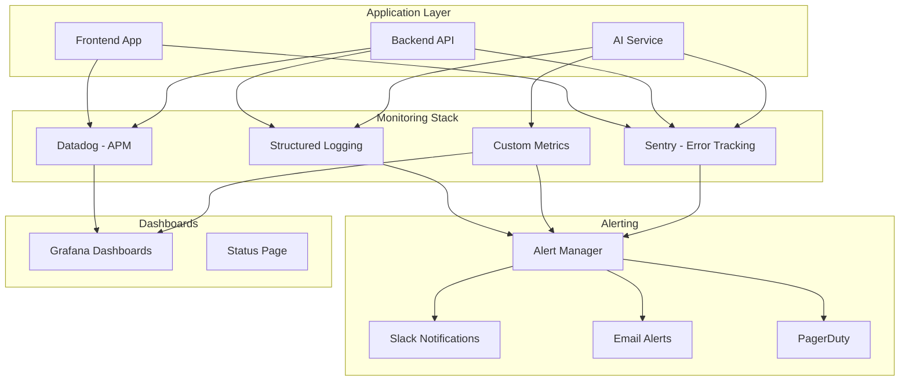

# Monitoring & Observability Specification

## Overview
Comprehensive monitoring and observability strategy for the financial dashboard, covering application performance, error tracking, logging, and alerting.

## Architecture



## Error Tracking

### Sentry Configuration

#### Frontend Setup
```typescript
// client/src/lib/sentry.ts

import * as Sentry from '@sentry/react'
import { BrowserTracing } from '@sentry/tracing'

export function initSentry() {
  Sentry.init({
    dsn: import.meta.env.VITE_SENTRY_DSN,
    integrations: [
      new BrowserTracing({
        tracePropagationTargets: ['localhost', /^\//]
      })
    ],
    environment: import.meta.env.MODE,
    tracesSampleRate: 0.1,
    replaysSessionSampleRate: 0.1,
    replaysOnErrorSampleRate: 1.0
  })
}

// Error Boundary
export function ErrorBoundary({ children }: { children: React.ReactNode }) {
  return (
    <Sentry.ErrorBoundary
      fallback={({ error, resetError }) => (
        <div>
          <h2>Something went wrong</h2>
          <p>{error.message}</p>
          <button onClick={resetError}>Try again</button>
        </div>
      )}
    >
      {children}
    </Sentry.ErrorBoundary>
  )
}
```

#### Backend Setup
```typescript
// server/src/lib/sentry.ts

import * as Sentry from '@sentry/node'
import { ProfilingIntegration } from '@sentry/profiling-node'

export function initSentry() {
  Sentry.init({
    dsn: process.env.SENTRY_DSN,
    integrations: [
      new ProfilingIntegration()
    ],
    environment: process.env.NODE_ENV,
    tracesSampleRate: 0.1,
    profilesSampleRate: 0.1
  })
}

// Express middleware
export function sentryRequestHandler() {
  return Sentry.Handlers.requestHandler()
}

export function sentryErrorHandler() {
  return Sentry.Handlers.errorHandler()
}
```

### Error Categories
```typescript
enum ErrorCategory {
  VALIDATION = 'validation',
  AUTHENTICATION = 'authentication',
  AUTHORIZATION = 'authorization',
  DATABASE = 'database',
  EXTERNAL_API = 'external_api',
  AI_SERVICE = 'ai_service',
  FILE_PROCESSING = 'file_processing',
  NETWORK = 'network',
  UNKNOWN = 'unknown'
}

interface ErrorContext {
  category: ErrorCategory
  userId?: string
  requestId?: string
  endpoint?: string
  metadata?: Record<string, any>
}

export function captureError(
  error: Error,
  context: ErrorContext
): void {
  Sentry.captureException(error, {
    tags: {
      category: context.category
    },
    user: context.userId ? { id: context.userId } : undefined,
    extra: {
      requestId: context.requestId,
      endpoint: context.endpoint,
      ...context.metadata
    }
  })
}
```

## Application Performance Monitoring (APM)

### Datadog Configuration

#### Frontend RUM (Real User Monitoring)
```typescript
// client/src/lib/datadog.ts

import { datadogRum } from '@datadog/browser-rum'

export function initDatadogRUM() {
  datadogRum.init({
    applicationId: import.meta.env.VITE_DATADOG_APP_ID,
    clientToken: import.meta.env.VITE_DATADOG_CLIENT_TOKEN,
    site: 'datadoghq.com',
    service: 'financial-dashboard',
    env: import.meta.env.MODE,
    version: import.meta.env.VITE_APP_VERSION,
    sessionSampleRate: 100,
    sessionReplaySampleRate: 20,
    trackUserInteractions: true,
    trackResources: true,
    trackLongTasks: true,
    defaultPrivacyLevel: 'mask-user-input'
  })
}

// Custom actions
export function trackUserAction(
  action: string,
  context?: Record<string, any>
) {
  datadogRum.addAction(action, context)
}

// Custom timing
export function trackTiming(
  name: string,
  duration: number,
  context?: Record<string, any>
) {
  datadogRum.addTiming(name, duration, context)
}
```

#### Backend APM
```typescript
// server/src/lib/datadog.ts

import tracer from 'dd-trace'

export function initDatadogTracer() {
  tracer.init({
    service: 'financial-dashboard-api',
    env: process.env.NODE_ENV,
    version: process.env.APP_VERSION,
    logInjection: true,
    runtimeMetrics: true,
    profiling: true
  })
}

// Custom spans
export function createSpan(
  name: string,
  options?: tracer.SpanOptions
): tracer.Span {
  return tracer.startSpan(name, options)
}

// Wrap async functions
export function traceAsync<T>(
  name: string,
  fn: () => Promise<T>
): Promise<T> {
  const span = createSpan(name)
  
  return fn()
    .then(result => {
      span.finish()
      return result
    })
    .catch(error => {
      span.setTag('error', true)
      span.finish()
      throw error
    })
}
```

### Key Performance Metrics

#### Frontend Metrics
```typescript
// client/src/lib/metrics.ts

export interface FrontendMetrics {
  // Core Web Vitals
  LCP: number // Largest Contentful Paint
  FID: number // First Input Delay
  CLS: number // Cumulative Layout Shift
  
  // Custom metrics
  pageLoadTime: number
  timeToInteractive: number
  apiResponseTime: number
  renderTime: number
}

export function trackPageLoad() {
  const navigation = performance.getEntriesByType('navigation')[0] as PerformanceNavigationTiming
  
  const metrics: FrontendMetrics = {
    LCP: 0,
    FID: 0,
    CLS: 0,
    pageLoadTime: navigation.loadEventEnd - navigation.startTime,
    timeToInteractive: navigation.domInteractive - navigation.startTime,
    apiResponseTime: 0,
    renderTime: 0
  }
  
  // Track LCP
  new PerformanceObserver((list) => {
    const entries = list.getEntries()
    const lastEntry = entries[entries.length - 1]
    metrics.LCP = lastEntry.startTime
  }).observe({ entryTypes: ['largest-contentful-paint'] })
  
  // Track FID
  new PerformanceObserver((list) => {
    const entries = list.getEntries()
    entries.forEach(entry => {
      metrics.FID = entry.processingStart - entry.startTime
    })
  }).observe({ entryTypes: ['first-input'] })
  
  // Track CLS
  new PerformanceObserver((list) => {
    list.getEntries().forEach(entry => {
      if (!entry.hadRecentInput) {
        metrics.CLS += entry.value
      }
    })
  }).observe({ entryTypes: ['layout-shift'] })
  
  return metrics
}
```

#### Backend Metrics
```typescript
// server/src/lib/metrics.ts

import { StatsD } from 'hot-shots'

const statsd = new StatsD({
  host: process.env.DATADOG_HOST,
  port: 8125,
  prefix: 'financial_dashboard.'
})

export function trackAPIMetric(
  metric: string,
  value: number,
  tags?: Record<string, string>
) {
  statsd.gauge(metric, value, tags)
}

export function trackAPICount(
  metric: string,
  tags?: Record<string, string>
) {
  statsd.increment(metric, tags)
}

export function trackAPITiming(
  metric: string,
  duration: number,
  tags?: Record<string, string>
) {
  statsd.timing(metric, duration, tags)
}

// API middleware
export function metricsMiddleware(req: any, res: any, next: any) {
  const start = Date.now()
  
  res.on('finish', () => {
    const duration = Date.now() - start
    
    trackAPITiming('api.request.duration', duration, {
      method: req.method,
      path: req.path,
      status: res.statusCode.toString()
    })
    
    trackAPICount('api.request.count', {
      method: req.method,
      path: req.path,
      status: res.statusCode.toString()
    })
  })
  
  next()
}
```

## Structured Logging

### Logger Configuration
```typescript
// server/src/lib/logger.ts

import winston from 'winston'
import { format } from 'winston'

const { combine, timestamp, json, errors } = format

export const logger = winston.createLogger({
  level: process.env.LOG_LEVEL || 'info',
  format: combine(
    timestamp(),
    errors({ stack: true }),
    json()
  ),
  defaultMeta: {
    service: 'financial-dashboard',
    environment: process.env.NODE_ENV
  },
  transports: [
    new winston.transports.Console({
      format: combine(
        timestamp(),
        json()
      )
    }),
    new winston.transports.File({
      filename: 'logs/error.log',
      level: 'error'
    }),
    new winston.transports.File({
      filename: 'logs/combined.log'
    })
  ]
})

// Request logging
export function requestLogger(req: any, res: any, next: any) {
  const start = Date.now()
  
  res.on('finish', () => {
    const duration = Date.now() - start
    
    logger.info('API Request', {
      method: req.method,
      path: req.path,
      statusCode: res.statusCode,
      duration,
      userId: req.user?.id,
      requestId: req.id,
      userAgent: req.get('user-agent'),
      ip: req.ip
    })
  })
  
  next()
}

// Error logging
export function errorLogger(error: Error, req: any, res: any, next: any) {
  logger.error('API Error', {
    error: error.message,
    stack: error.stack,
    method: req.method,
    path: req.path,
    userId: req.user?.id,
    requestId: req.id
  })
  
  next(error)
}
```

### Log Levels & Categories
```typescript
enum LogLevel {
  ERROR = 'error',
  WARN = 'warn',
  INFO = 'info',
  DEBUG = 'debug'
}

enum LogCategory {
  AUTH = 'auth',
  API = 'api',
  DATABASE = 'database',
  AI = 'ai',
  FILE = 'file',
  SECURITY = 'security',
  PERFORMANCE = 'performance'
}

interface LogContext {
  category: LogCategory
  userId?: string
  requestId?: string
  metadata?: Record<string, any>
}

export function log(
  level: LogLevel,
  message: string,
  context: LogContext
) {
  logger.log(level, message, {
    category: context.category,
    userId: context.userId,
    requestId: context.requestId,
    ...context.metadata
  })
}
```

## Custom Metrics

### Business Metrics
```typescript
// server/src/lib/business-metrics.ts

export class BusinessMetrics {
  private statsd: StatsD
  
  constructor() {
    this.statsd = new StatsD({
      host: process.env.DATADOG_HOST,
      port: 8125,
      prefix: 'financial_dashboard.business.'
    })
  }
  
  // User metrics
  trackUserRegistration(userId: string) {
    this.statsd.increment('user.registration', { userId })
  }
  
  trackUserLogin(userId: string) {
    this.statsd.increment('user.login', { userId })
  }
  
  // Transaction metrics
  trackTransactionCreated(
    userId: string,
    amount: number,
    category: string
  ) {
    this.statsd.increment('transaction.created', {
      userId,
      category
    })
    this.statsd.gauge('transaction.amount', amount, {
      userId,
      category
    })
  }
  
  // AI metrics
  trackAIQuery(
    userId: string,
    queryType: string,
    model: string,
    tokensUsed: number,
    responseTime: number
  ) {
    this.statsd.increment('ai.query', {
      userId,
      queryType,
      model
    })
    this.statsd.gauge('ai.tokens', tokensUsed, {
      userId,
      queryType,
      model
    })
    this.statsd.timing('ai.response_time', responseTime, {
      userId,
      queryType,
      model
    })
  }
  
  // File processing metrics
  trackFileUpload(
    userId: string,
    fileType: string,
    fileSize: number
  ) {
    this.statsd.increment('file.upload', {
      userId,
      fileType
    })
    this.statsd.gauge('file.size', fileSize, {
      userId,
      fileType
    })
  }
  
  trackFileProcessing(
    fileId: string,
    fileType: string,
    processingTime: number,
    success: boolean
  ) {
    this.statsd.timing('file.processing_time', processingTime, {
      fileType,
      success: success.toString()
    })
    
    if (!success) {
      this.statsd.increment('file.processing_error', {
        fileType
      })
    }
  }
  
  // Financial metrics
  trackBalanceUpdate(
    userId: string,
    accountId: string,
    balance: number
  ) {
    this.statsd.gauge('account.balance', balance, {
      userId,
      accountId
    })
  }
  
  trackBudgetUsage(
    userId: string,
    categoryId: string,
    percentage: number
  ) {
    this.statsd.gauge('budget.usage', percentage, {
      userId,
      categoryId
    })
  }
}
```

### AI-Specific Metrics
```typescript
// server/src/lib/ai-metrics.ts

export class AIMetrics {
  private statsd: StatsD
  
  constructor() {
    this.statsd = new StatsD({
      host: process.env.DATADOG_HOST,
      port: 8125,
      prefix: 'financial_dashboard.ai.'
    })
  }
  
  trackModelSelection(
    queryType: string,
    complexity: number,
    model: string
  ) {
    this.statsd.increment('model.selection', {
      queryType,
      model
    })
    this.statsd.gauge('query.complexity', complexity, {
      queryType
    })
  }
  
  trackTokenUsage(
    userId: string,
    model: string,
    promptTokens: number,
    responseTokens: number,
    cost: number
  ) {
    this.statsd.increment('tokens.prompt', promptTokens, {
      userId,
      model
    })
    this.statsd.increment('tokens.response', responseTokens, {
      userId,
      model
    })
    this.statsd.increment('tokens.total', promptTokens + responseTokens, {
      userId,
      model
    })
    this.statsd.gauge('cost', cost, {
      userId,
      model
    })
  }
  
  trackResponseQuality(
    userId: string,
    queryType: string,
    confidence: number,
    feedback?: 'helpful' | 'not_helpful'
  ) {
    this.statsd.gauge('response.confidence', confidence, {
      userId,
      queryType
    })
    
    if (feedback) {
      this.statsd.increment('response.feedback', {
        userId,
        queryType,
        feedback
      })
    }
  }
  
  trackError(
    errorType: string,
    model: string,
    queryType: string
  ) {
    this.statsd.increment('error', {
      errorType,
      model,
      queryType
    })
  }
}
```

## Alerting

### Alert Configuration
```typescript
// server/src/lib/alerts.ts

export interface Alert {
  name: string
  condition: () => Promise<boolean>
  severity: 'low' | 'medium' | 'high' | 'critical'
  channels: AlertChannel[]
  cooldown: number // minutes
}

export enum AlertChannel {
  SLACK = 'slack',
  EMAIL = 'email',
  PAGERDUTY = 'pagerduty'
}

export const alerts: Alert[] = [
  {
    name: 'High Error Rate',
    condition: async () => {
      const errorRate = await getErrorRate()
      return errorRate > 0.05 // 5%
    },
    severity: 'high',
    channels: [AlertChannel.SLACK, AlertChannel.EMAIL],
    cooldown: 15
  },
  {
    name: 'Slow API Response',
    condition: async () => {
      const p95 = await getAPIResponseTimeP95()
      return p95 > 2000 // 2 seconds
    },
    severity: 'medium',
    channels: [AlertChannel.SLACK],
    cooldown: 30
  },
  {
    name: 'AI Service Errors',
    condition: async () => {
      const errorRate = await getAIErrorRate()
      return errorRate > 0.1 // 10%
    },
    severity: 'high',
    channels: [AlertChannel.SLACK, AlertChannel.PAGERDUTY],
    cooldown: 10
  },
  {
    name: 'High Token Usage',
    condition: async () => {
      const dailyTokens = await getDailyTokenUsage()
      return dailyTokens > 1000000 // 1M tokens
    },
    severity: 'medium',
    channels: [AlertChannel.SLACK, AlertChannel.EMAIL],
    cooldown: 60
  },
  {
    name: 'File Processing Failures',
    condition: async () => {
      const failureRate = await getFileProcessingFailureRate()
      return failureRate > 0.1 // 10%
    },
    severity: 'medium',
    channels: [AlertChannel.SLACK],
    cooldown: 30
  },
  {
    name: 'Database Connection Issues',
    condition: async () => {
      const isConnected = await checkDatabaseConnection()
      return !isConnected
    },
    severity: 'critical',
    channels: [AlertChannel.SLACK, AlertChannel.PAGERDUTY],
    cooldown: 5
  },
  {
    name: 'High Memory Usage',
    condition: async () => {
      const memoryUsage = process.memoryUsage()
      const heapUsedPercent = memoryUsage.heapUsed / memoryUsage.heapTotal
      return heapUsedPercent > 0.9 // 90%
    },
    severity: 'high',
    channels: [AlertChannel.SLACK, AlertChannel.PAGERDUTY],
    cooldown: 15
  }
]
```

### Alert Manager
```typescript
// server/src/lib/alert-manager.ts

import { WebClient } from '@slack/web-api'
import nodemailer from 'nodemailer'

export class AlertManager {
  private slack: WebClient
  private emailTransporter: nodemailer.Transporter
  private cooldowns: Map<string, number> = new Map()
  
  constructor() {
    this.slack = new WebClient(process.env.SLACK_TOKEN)
    this.emailTransporter = nodemailer.createTransport({
      host: process.env.SMTP_HOST,
      port: parseInt(process.env.SMTP_PORT || '587'),
      auth: {
        user: process.env.SMTP_USER,
        pass: process.env.SMTP_PASS
      }
    })
  }
  
  async checkAlerts() {
    for (const alert of alerts) {
      // Check cooldown
      const lastTriggered = this.cooldowns.get(alert.name)
      if (lastTriggered && Date.now() - lastTriggered < alert.cooldown * 60 * 1000) {
        continue
      }
      
      // Check condition
      const triggered = await alert.condition()
      
      if (triggered) {
        await this.triggerAlert(alert)
        this.cooldowns.set(alert.name, Date.now())
      }
    }
  }
  
  private async triggerAlert(alert: Alert) {
    const message = this.formatAlertMessage(alert)
    
    for (const channel of alert.channels) {
      switch (channel) {
        case AlertChannel.SLACK:
          await this.sendSlackAlert(message, alert.severity)
          break
        case AlertChannel.EMAIL:
          await this.sendEmailAlert(message, alert.severity)
          break
        case AlertChannel.PAGERDUTY:
          await this.sendPagerDutyAlert(message, alert.severity)
          break
      }
    }
  }
  
  private formatAlertMessage(alert: Alert): string {
    const emoji = {
      low: 'ℹ️',
      medium: '⚠️',
      high: '🔴',
      critical: '🚨'
    }
    
    return `${emoji[alert.severity]} *${alert.name}*\n\nSeverity: ${alert.severity}\nTime: ${new Date().toISOString()}`
  }
  
  private async sendSlackAlert(message: string, severity: string) {
    const channel = severity === 'critical' ? '#alerts-critical' : '#alerts'
    
    await this.slack.chat.postMessage({
      channel,
      text: message,
      unfurl_links: false
    })
  }
  
  private async sendEmailAlert(message: string, severity: string) {
    const recipients = process.env.ALERT_EMAIL_RECIPIENTS?.split(',') || []
    
    await this.emailTransporter.sendMail({
      from: process.env.ALERT_EMAIL_FROM,
      to: recipients.join(','),
      subject: `[${severity.toUpperCase()}] Financial Dashboard Alert`,
      text: message,
      html: `<pre>${message}</pre>`
    })
  }
  
  private async sendPagerDutyAlert(message: string, severity: string) {
    // PagerDuty integration
    const response = await fetch('https://events.pagerduty.com/v2/enqueue', {
      method: 'POST',
      headers: {
        'Content-Type': 'application/json'
      },
      body: JSON.stringify({
        routing_key: process.env.PAGERDUTY_ROUTING_KEY,
        event_action: 'trigger',
        payload: {
          summary: message,
          severity: severity === 'critical' ? 'critical' : 'error',
          source: 'financial-dashboard'
        }
      })
    })
    
    if (!response.ok) {
      console.error('Failed to send PagerDuty alert')
    }
  }
}
```

## Dashboards

### Grafana Dashboards

#### API Performance Dashboard
```json
{
  "dashboard": {
    "title": "Financial Dashboard - API Performance",
    "panels": [
      {
        "title": "Request Rate",
        "type": "graph",
        "targets": [
          {
            "expr": "rate(financial_dashboard_api_request_count[5m])",
            "legendFormat": "{{method}} {{path}}"
          }
        ]
      },
      {
        "title": "Response Time (P95)",
        "type": "graph",
        "targets": [
          {
            "expr": "histogram_quantile(0.95, rate(financial_dashboard_api_request_duration_bucket[5m]))",
            "legendFormat": "P95"
          }
        ]
      },
      {
        "title": "Error Rate",
        "type": "graph",
        "targets": [
          {
            "expr": "rate(financial_dashboard_api_request_count{status=~'5..'}[5m]) / rate(financial_dashboard_api_request_count[5m])",
            "legendFormat": "Error Rate"
          }
        ]
      }
    ]
  }
}
```

#### AI Performance Dashboard
```json
{
  "dashboard": {
    "title": "Financial Dashboard - AI Performance",
    "panels": [
      {
        "title": "AI Query Rate",
        "type": "graph",
        "targets": [
          {
            "expr": "rate(financial_dashboard_ai_query_count[5m])",
            "legendFormat": "{{queryType}}"
          }
        ]
      },
      {
        "title": "Token Usage",
        "type": "graph",
        "targets": [
          {
            "expr": "rate(financial_dashboard_ai_tokens_total[5m])",
            "legendFormat": "{{model}}"
          }
        ]
      },
      {
        "title": "AI Response Time",
        "type": "graph",
        "targets": [
          {
            "expr": "histogram_quantile(0.95, rate(financial_dashboard_ai_response_time_bucket[5m]))",
            "legendFormat": "P95"
          }
        ]
      },
      {
        "title": "AI Cost",
        "type": "stat",
        "targets": [
          {
            "expr": "sum(financial_dashboard_ai_cost)",
            "legendFormat": "Total Cost"
          }
        ]
      }
    ]
  }
}
```

### Status Page
```typescript
// server/src/lib/status-page.ts

export class StatusPage {
  async getStatus(): Promise<SystemStatus> {
    const checks = await Promise.all([
      this.checkDatabase(),
      this.checkRedis(),
      this.checkVertexAI(),
      this.checkSupabase()
    ])
    
    const allHealthy = checks.every(check => check.healthy)
    
    return {
      status: allHealthy ? 'operational' : 'degraded',
      checks,
      timestamp: new Date().toISOString()
    }
  }
  
  private async checkDatabase(): Promise<HealthCheck> {
    try {
      // Simple query to check connection
      await supabase.from('users').select('id').limit(1)
      
      return {
        name: 'Database',
        healthy: true,
        latency: 0
      }
    } catch (error) {
      return {
        name: 'Database',
        healthy: false,
        error: error.message
      }
    }
  }
  
  private async checkRedis(): Promise<HealthCheck> {
    try {
      const start = Date.now()
      await redis.ping()
      const latency = Date.now() - start
      
      return {
        name: 'Redis',
        healthy: true,
        latency
      }
    } catch (error) {
      return {
        name: 'Redis',
        healthy: false,
        error: error.message
      }
    }
  }
  
  private async checkVertexAI(): Promise<HealthCheck> {
    try {
      // Simple health check
      const client = new PredictionServiceClient()
      // Just check if we can create a client
      return {
        name: 'Vertex AI',
        healthy: true
      }
    } catch (error) {
      return {
        name: 'Vertex AI',
        healthy: false,
        error: error.message
      }
    }
  }
  
  private async checkSupabase(): Promise<HealthCheck> {
    try {
      const { data, error } = await supabase.from('users').select('id').limit(1)
      
      return {
        name: 'Supabase',
        healthy: !error,
        error: error?.message
      }
    } catch (error) {
      return {
        name: 'Supabase',
        healthy: false,
        error: error.message
      }
    }
  }
}
```

## Cost Tracking

### Vertex AI Cost Monitoring
```typescript
// server/src/lib/cost-tracker.ts

export class CostTracker {
  private statsd: StatsD
  
  constructor() {
    this.statsd = new StatsD({
      host: process.env.DATADOG_HOST,
      port: 8125,
      prefix: 'financial_dashboard.cost.'
    })
  }
  
  async trackDailyCosts() {
    const today = new Date().toISOString().split('T')[0]
    
    // Get token usage from database
    const { data: usage } = await supabase
      .from('token_usage')
      .select('*')
      .eq('date', today)
    
    if (!usage) return
    
    const totalCost = usage.reduce((sum, u) => sum + u.cost, 0)
    const totalTokens = usage.reduce((sum, u) => sum + u.total_tokens, 0)
    
    this.statsd.gauge('daily.total', totalCost)
    this.statsd.gauge('daily.tokens', totalTokens)
    
    // Alert if cost exceeds threshold
    if (totalCost > 100) { // $100 daily threshold
      await this.sendCostAlert(totalCost, totalTokens)
    }
  }
  
  private async sendCostAlert(cost: number, tokens: number) {
    const message = `⚠️ High AI Cost Alert\n\nDaily cost: $${cost.toFixed(2)}\nTokens used: ${tokens.toLocaleString()}`
    
    // Send to Slack
    await slack.chat.postMessage({
      channel: '#alerts',
      text: message
    })
  }
}
```

## Environment Variables

### Monitoring Configuration
```env
# Sentry
VITE_SENTRY_DSN=
SENTRY_DSN=

# Datadog
VITE_DATADOG_APP_ID=
VITE_DATADOG_CLIENT_TOKEN=
DATADOG_HOST=

# Logging
LOG_LEVEL=info

# Alerting
SLACK_TOKEN=
ALERT_EMAIL_FROM=
ALERT_EMAIL_RECIPIENTS=
SMTP_HOST=
SMTP_PORT=
SMTP_USER=
SMTP_PASS=
PAGERDUTY_ROUTING_KEY=
```

## Implementation Checklist

### Phase 1: Basic Monitoring
- [ ] Set up Sentry for error tracking
- [ ] Configure structured logging
- [ ] Add basic API metrics
- [ ] Set up Slack alerts

### Phase 2: Advanced Monitoring
- [ ] Set up Datadog APM
- [ ] Configure custom business metrics
- [ ] Add AI-specific metrics
- [ ] Set up Grafana dashboards

### Phase 3: Alerting & Response
- [ ] Configure alert rules
- [ ] Set up PagerDuty integration
- [ ] Create runbooks for common issues
- [ ] Set up status page

### Phase 4: Optimization
- [ ] Analyze performance bottlenecks
- [ ] Optimize based on metrics
- [ ] Set up cost tracking
- [ ] Create capacity planning reports

---

**Status**: Draft
**Last Updated**: 2026-03-22
**Next Review**: Before implementation begins

## Overview
Comprehensive monitoring and observability strategy for the financial dashboard, covering application performance, error tracking, logging, and alerting.

## Architecture


## Error Tracking

### Sentry Configuration

#### Frontend Setup
```typescript
// client/src/lib/sentry.ts

import * as Sentry from '@sentry/react'
import { BrowserTracing } from '@sentry/tracing'

export function initSentry() {
  Sentry.init({
    dsn: import.meta.env.VITE_SENTRY_DSN,
    integrations: [
      new BrowserTracing({
        tracePropagationTargets: ['localhost', /^\//]
      })
    ],
    environment: import.meta.env.MODE,
    tracesSampleRate: 0.1,
    replaysSessionSampleRate: 0.1,
    replaysOnErrorSampleRate: 1.0
  })
}

// Error Boundary
export function ErrorBoundary({ children }: { children: React.ReactNode }) {
  return (
    <Sentry.ErrorBoundary
      fallback={({ error, resetError }) => (
        <div>
          <h2>Something went wrong</h2>
          <p>{error.message}</p>
          <button onClick={resetError}>Try again</button>
        </div>
      )}
    >
      {children}
    </Sentry.ErrorBoundary>
  )
}
```

#### Backend Setup
```typescript
// server/src/lib/sentry.ts

import * as Sentry from '@sentry/node'
import { ProfilingIntegration } from '@sentry/profiling-node'

export function initSentry() {
  Sentry.init({
    dsn: process.env.SENTRY_DSN,
    integrations: [
      new ProfilingIntegration()
    ],
    environment: process.env.NODE_ENV,
    tracesSampleRate: 0.1,
    profilesSampleRate: 0.1
  })
}

// Express middleware
export function sentryRequestHandler() {
  return Sentry.Handlers.requestHandler()
}

export function sentryErrorHandler() {
  return Sentry.Handlers.errorHandler()
}
```

### Error Categories
```typescript
enum ErrorCategory {
  VALIDATION = 'validation',
  AUTHENTICATION = 'authentication',
  AUTHORIZATION = 'authorization',
  DATABASE = 'database',
  EXTERNAL_API = 'external_api',
  AI_SERVICE = 'ai_service',
  FILE_PROCESSING = 'file_processing',
  NETWORK = 'network',
  UNKNOWN = 'unknown'
}

interface ErrorContext {
  category: ErrorCategory
  userId?: string
  requestId?: string
  endpoint?: string
  metadata?: Record<string, any>
}

export function captureError(
  error: Error,
  context: ErrorContext
): void {
  Sentry.captureException(error, {
    tags: {
      category: context.category
    },
    user: context.userId ? { id: context.userId } : undefined,
    extra: {
      requestId: context.requestId,
      endpoint: context.endpoint,
      ...context.metadata
    }
  })
}
```

## Application Performance Monitoring (APM)

### Datadog Configuration

#### Frontend RUM (Real User Monitoring)
```typescript
// client/src/lib/datadog.ts

import { datadogRum } from '@datadog/browser-rum'

export function initDatadogRUM() {
  datadogRum.init({
    applicationId: import.meta.env.VITE_DATADOG_APP_ID,
    clientToken: import.meta.env.VITE_DATADOG_CLIENT_TOKEN,
    site: 'datadoghq.com',
    service: 'financial-dashboard',
    env: import.meta.env.MODE,
    version: import.meta.env.VITE_APP_VERSION,
    sessionSampleRate: 100,
    sessionReplaySampleRate: 20,
    trackUserInteractions: true,
    trackResources: true,
    trackLongTasks: true,
    defaultPrivacyLevel: 'mask-user-input'
  })
}

// Custom actions
export function trackUserAction(
  action: string,
  context?: Record<string, any>
) {
  datadogRum.addAction(action, context)
}

// Custom timing
export function trackTiming(
  name: string,
  duration: number,
  context?: Record<string, any>
) {
  datadogRum.addTiming(name, duration, context)
}
```

#### Backend APM
```typescript
// server/src/lib/datadog.ts

import tracer from 'dd-trace'

export function initDatadogTracer() {
  tracer.init({
    service: 'financial-dashboard-api',
    env: process.env.NODE_ENV,
    version: process.env.APP_VERSION,
    logInjection: true,
    runtimeMetrics: true,
    profiling: true
  })
}

// Custom spans
export function createSpan(
  name: string,
  options?: tracer.SpanOptions
): tracer.Span {
  return tracer.startSpan(name, options)
}

// Wrap async functions
export function traceAsync<T>(
  name: string,
  fn: () => Promise<T>
): Promise<T> {
  const span = createSpan(name)
  
  return fn()
    .then(result => {
      span.finish()
      return result
    })
    .catch(error => {
      span.setTag('error', true)
      span.finish()
      throw error
    })
}
```

### Key Performance Metrics

#### Frontend Metrics
```typescript
// client/src/lib/metrics.ts

export interface FrontendMetrics {
  // Core Web Vitals
  LCP: number // Largest Contentful Paint
  FID: number // First Input Delay
  CLS: number // Cumulative Layout Shift
  
  // Custom metrics
  pageLoadTime: number
  timeToInteractive: number
  apiResponseTime: number
  renderTime: number
}

export function trackPageLoad() {
  const navigation = performance.getEntriesByType('navigation')[0] as PerformanceNavigationTiming
  
  const metrics: FrontendMetrics = {
    LCP: 0,
    FID: 0,
    CLS: 0,
    pageLoadTime: navigation.loadEventEnd - navigation.startTime,
    timeToInteractive: navigation.domInteractive - navigation.startTime,
    apiResponseTime: 0,
    renderTime: 0
  }
  
  // Track LCP
  new PerformanceObserver((list) => {
    const entries = list.getEntries()
    const lastEntry = entries[entries.length - 1]
    metrics.LCP = lastEntry.startTime
  }).observe({ entryTypes: ['largest-contentful-paint'] })
  
  // Track FID
  new PerformanceObserver((list) => {
    const entries = list.getEntries()
    entries.forEach(entry => {
      metrics.FID = entry.processingStart - entry.startTime
    })
  }).observe({ entryTypes: ['first-input'] })
  
  // Track CLS
  new PerformanceObserver((list) => {
    list.getEntries().forEach(entry => {
      if (!entry.hadRecentInput) {
        metrics.CLS += entry.value
      }
    })
  }).observe({ entryTypes: ['layout-shift'] })
  
  return metrics
}
```

#### Backend Metrics
```typescript
// server/src/lib/metrics.ts

import { StatsD } from 'hot-shots'

const statsd = new StatsD({
  host: process.env.DATADOG_HOST,
  port: 8125,
  prefix: 'financial_dashboard.'
})

export function trackAPIMetric(
  metric: string,
  value: number,
  tags?: Record<string, string>
) {
  statsd.gauge(metric, value, tags)
}

export function trackAPICount(
  metric: string,
  tags?: Record<string, string>
) {
  statsd.increment(metric, tags)
}

export function trackAPITiming(
  metric: string,
  duration: number,
  tags?: Record<string, string>
) {
  statsd.timing(metric, duration, tags)
}

// API middleware
export function metricsMiddleware(req: any, res: any, next: any) {
  const start = Date.now()
  
  res.on('finish', () => {
    const duration = Date.now() - start
    
    trackAPITiming('api.request.duration', duration, {
      method: req.method,
      path: req.path,
      status: res.statusCode.toString()
    })
    
    trackAPICount('api.request.count', {
      method: req.method,
      path: req.path,
      status: res.statusCode.toString()
    })
  })
  
  next()
}
```

## Structured Logging

### Logger Configuration
```typescript
// server/src/lib/logger.ts

import winston from 'winston'
import { format } from 'winston'

const { combine, timestamp, json, errors } = format

export const logger = winston.createLogger({
  level: process.env.LOG_LEVEL || 'info',
  format: combine(
    timestamp(),
    errors({ stack: true }),
    json()
  ),
  defaultMeta: {
    service: 'financial-dashboard',
    environment: process.env.NODE_ENV
  },
  transports: [
    new winston.transports.Console({
      format: combine(
        timestamp(),
        json()
      )
    }),
    new winston.transports.File({
      filename: 'logs/error.log',
      level: 'error'
    }),
    new winston.transports.File({
      filename: 'logs/combined.log'
    })
  ]
})

// Request logging
export function requestLogger(req: any, res: any, next: any) {
  const start = Date.now()
  
  res.on('finish', () => {
    const duration = Date.now() - start
    
    logger.info('API Request', {
      method: req.method,
      path: req.path,
      statusCode: res.statusCode,
      duration,
      userId: req.user?.id,
      requestId: req.id,
      userAgent: req.get('user-agent'),
      ip: req.ip
    })
  })
  
  next()
}

// Error logging
export function errorLogger(error: Error, req: any, res: any, next: any) {
  logger.error('API Error', {
    error: error.message,
    stack: error.stack,
    method: req.method,
    path: req.path,
    userId: req.user?.id,
    requestId: req.id
  })
  
  next(error)
}
```

### Log Levels & Categories
```typescript
enum LogLevel {
  ERROR = 'error',
  WARN = 'warn',
  INFO = 'info',
  DEBUG = 'debug'
}

enum LogCategory {
  AUTH = 'auth',
  API = 'api',
  DATABASE = 'database',
  AI = 'ai',
  FILE = 'file',
  SECURITY = 'security',
  PERFORMANCE = 'performance'
}

interface LogContext {
  category: LogCategory
  userId?: string
  requestId?: string
  metadata?: Record<string, any>
}

export function log(
  level: LogLevel,
  message: string,
  context: LogContext
) {
  logger.log(level, message, {
    category: context.category,
    userId: context.userId,
    requestId: context.requestId,
    ...context.metadata
  })
}
```

## Custom Metrics

### Business Metrics
```typescript
// server/src/lib/business-metrics.ts

export class BusinessMetrics {
  private statsd: StatsD
  
  constructor() {
    this.statsd = new StatsD({
      host: process.env.DATADOG_HOST,
      port: 8125,
      prefix: 'financial_dashboard.business.'
    })
  }
  
  // User metrics
  trackUserRegistration(userId: string) {
    this.statsd.increment('user.registration', { userId })
  }
  
  trackUserLogin(userId: string) {
    this.statsd.increment('user.login', { userId })
  }
  
  // Transaction metrics
  trackTransactionCreated(
    userId: string,
    amount: number,
    category: string
  ) {
    this.statsd.increment('transaction.created', {
      userId,
      category
    })
    this.statsd.gauge('transaction.amount', amount, {
      userId,
      category
    })
  }
  
  // AI metrics
  trackAIQuery(
    userId: string,
    queryType: string,
    model: string,
    tokensUsed: number,
    responseTime: number
  ) {
    this.statsd.increment('ai.query', {
      userId,
      queryType,
      model
    })
    this.statsd.gauge('ai.tokens', tokensUsed, {
      userId,
      queryType,
      model
    })
    this.statsd.timing('ai.response_time', responseTime, {
      userId,
      queryType,
      model
    })
  }
  
  // File processing metrics
  trackFileUpload(
    userId: string,
    fileType: string,
    fileSize: number
  ) {
    this.statsd.increment('file.upload', {
      userId,
      fileType
    })
    this.statsd.gauge('file.size', fileSize, {
      userId,
      fileType
    })
  }
  
  trackFileProcessing(
    fileId: string,
    fileType: string,
    processingTime: number,
    success: boolean
  ) {
    this.statsd.timing('file.processing_time', processingTime, {
      fileType,
      success: success.toString()
    })
    
    if (!success) {
      this.statsd.increment('file.processing_error', {
        fileType
      })
    }
  }
  
  // Financial metrics
  trackBalanceUpdate(
    userId: string,
    accountId: string,
    balance: number
  ) {
    this.statsd.gauge('account.balance', balance, {
      userId,
      accountId
    })
  }
  
  trackBudgetUsage(
    userId: string,
    categoryId: string,
    percentage: number
  ) {
    this.statsd.gauge('budget.usage', percentage, {
      userId,
      categoryId
    })
  }
}
```

### AI-Specific Metrics
```typescript
// server/src/lib/ai-metrics.ts

export class AIMetrics {
  private statsd: StatsD
  
  constructor() {
    this.statsd = new StatsD({
      host: process.env.DATADOG_HOST,
      port: 8125,
      prefix: 'financial_dashboard.ai.'
    })
  }
  
  trackModelSelection(
    queryType: string,
    complexity: number,
    model: string
  ) {
    this.statsd.increment('model.selection', {
      queryType,
      model
    })
    this.statsd.gauge('query.complexity', complexity, {
      queryType
    })
  }
  
  trackTokenUsage(
    userId: string,
    model: string,
    promptTokens: number,
    responseTokens: number,
    cost: number
  ) {
    this.statsd.increment('tokens.prompt', promptTokens, {
      userId,
      model
    })
    this.statsd.increment('tokens.response', responseTokens, {
      userId,
      model
    })
    this.statsd.increment('tokens.total', promptTokens + responseTokens, {
      userId,
      model
    })
    this.statsd.gauge('cost', cost, {
      userId,
      model
    })
  }
  
  trackResponseQuality(
    userId: string,
    queryType: string,
    confidence: number,
    feedback?: 'helpful' | 'not_helpful'
  ) {
    this.statsd.gauge('response.confidence', confidence, {
      userId,
      queryType
    })
    
    if (feedback) {
      this.statsd.increment('response.feedback', {
        userId,
        queryType,
        feedback
      })
    }
  }
  
  trackError(
    errorType: string,
    model: string,
    queryType: string
  ) {
    this.statsd.increment('error', {
      errorType,
      model,
      queryType
    })
  }
}
```

## Alerting

### Alert Configuration
```typescript
// server/src/lib/alerts.ts

export interface Alert {
  name: string
  condition: () => Promise<boolean>
  severity: 'low' | 'medium' | 'high' | 'critical'
  channels: AlertChannel[]
  cooldown: number // minutes
}

export enum AlertChannel {
  SLACK = 'slack',
  EMAIL = 'email',
  PAGERDUTY = 'pagerduty'
}

export const alerts: Alert[] = [
  {
    name: 'High Error Rate',
    condition: async () => {
      const errorRate = await getErrorRate()
      return errorRate > 0.05 // 5%
    },
    severity: 'high',
    channels: [AlertChannel.SLACK, AlertChannel.EMAIL],
    cooldown: 15
  },
  {
    name: 'Slow API Response',
    condition: async () => {
      const p95 = await getAPIResponseTimeP95()
      return p95 > 2000 // 2 seconds
    },
    severity: 'medium',
    channels: [AlertChannel.SLACK],
    cooldown: 30
  },
  {
    name: 'AI Service Errors',
    condition: async () => {
      const errorRate = await getAIErrorRate()
      return errorRate > 0.1 // 10%
    },
    severity: 'high',
    channels: [AlertChannel.SLACK, AlertChannel.PAGERDUTY],
    cooldown: 10
  },
  {
    name: 'High Token Usage',
    condition: async () => {
      const dailyTokens = await getDailyTokenUsage()
      return dailyTokens > 1000000 // 1M tokens
    },
    severity: 'medium',
    channels: [AlertChannel.SLACK, AlertChannel.EMAIL],
    cooldown: 60
  },
  {
    name: 'File Processing Failures',
    condition: async () => {
      const failureRate = await getFileProcessingFailureRate()
      return failureRate > 0.1 // 10%
    },
    severity: 'medium',
    channels: [AlertChannel.SLACK],
    cooldown: 30
  },
  {
    name: 'Database Connection Issues',
    condition: async () => {
      const isConnected = await checkDatabaseConnection()
      return !isConnected
    },
    severity: 'critical',
    channels: [AlertChannel.SLACK, AlertChannel.PAGERDUTY],
    cooldown: 5
  },
  {
    name: 'High Memory Usage',
    condition: async () => {
      const memoryUsage = process.memoryUsage()
      const heapUsedPercent = memoryUsage.heapUsed / memoryUsage.heapTotal
      return heapUsedPercent > 0.9 // 90%
    },
    severity: 'high',
    channels: [AlertChannel.SLACK, AlertChannel.PAGERDUTY],
    cooldown: 15
  }
]
```

### Alert Manager
```typescript
// server/src/lib/alert-manager.ts

import { WebClient } from '@slack/web-api'
import nodemailer from 'nodemailer'

export class AlertManager {
  private slack: WebClient
  private emailTransporter: nodemailer.Transporter
  private cooldowns: Map<string, number> = new Map()
  
  constructor() {
    this.slack = new WebClient(process.env.SLACK_TOKEN)
    this.emailTransporter = nodemailer.createTransport({
      host: process.env.SMTP_HOST,
      port: parseInt(process.env.SMTP_PORT || '587'),
      auth: {
        user: process.env.SMTP_USER,
        pass: process.env.SMTP_PASS
      }
    })
  }
  
  async checkAlerts() {
    for (const alert of alerts) {
      // Check cooldown
      const lastTriggered = this.cooldowns.get(alert.name)
      if (lastTriggered && Date.now() - lastTriggered < alert.cooldown * 60 * 1000) {
        continue
      }
      
      // Check condition
      const triggered = await alert.condition()
      
      if (triggered) {
        await this.triggerAlert(alert)
        this.cooldowns.set(alert.name, Date.now())
      }
    }
  }
  
  private async triggerAlert(alert: Alert) {
    const message = this.formatAlertMessage(alert)
    
    for (const channel of alert.channels) {
      switch (channel) {
        case AlertChannel.SLACK:
          await this.sendSlackAlert(message, alert.severity)
          break
        case AlertChannel.EMAIL:
          await this.sendEmailAlert(message, alert.severity)
          break
        case AlertChannel.PAGERDUTY:
          await this.sendPagerDutyAlert(message, alert.severity)
          break
      }
    }
  }
  
  private formatAlertMessage(alert: Alert): string {
    const emoji = {
      low: 'ℹ️',
      medium: '⚠️',
      high: '🔴',
      critical: '🚨'
    }
    
    return `${emoji[alert.severity]} *${alert.name}*\n\nSeverity: ${alert.severity}\nTime: ${new Date().toISOString()}`
  }
  
  private async sendSlackAlert(message: string, severity: string) {
    const channel = severity === 'critical' ? '#alerts-critical' : '#alerts'
    
    await this.slack.chat.postMessage({
      channel,
      text: message,
      unfurl_links: false
    })
  }
  
  private async sendEmailAlert(message: string, severity: string) {
    const recipients = process.env.ALERT_EMAIL_RECIPIENTS?.split(',') || []
    
    await this.emailTransporter.sendMail({
      from: process.env.ALERT_EMAIL_FROM,
      to: recipients.join(','),
      subject: `[${severity.toUpperCase()}] Financial Dashboard Alert`,
      text: message,
      html: `<pre>${message}</pre>`
    })
  }
  
  private async sendPagerDutyAlert(message: string, severity: string) {
    // PagerDuty integration
    const response = await fetch('https://events.pagerduty.com/v2/enqueue', {
      method: 'POST',
      headers: {
        'Content-Type': 'application/json'
      },
      body: JSON.stringify({
        routing_key: process.env.PAGERDUTY_ROUTING_KEY,
        event_action: 'trigger',
        payload: {
          summary: message,
          severity: severity === 'critical' ? 'critical' : 'error',
          source: 'financial-dashboard'
        }
      })
    })
    
    if (!response.ok) {
      console.error('Failed to send PagerDuty alert')
    }
  }
}
```

## Dashboards

### Grafana Dashboards

#### API Performance Dashboard
```json
{
  "dashboard": {
    "title": "Financial Dashboard - API Performance",
    "panels": [
      {
        "title": "Request Rate",
        "type": "graph",
        "targets": [
          {
            "expr": "rate(financial_dashboard_api_request_count[5m])",
            "legendFormat": "{{method}} {{path}}"
          }
        ]
      },
      {
        "title": "Response Time (P95)",
        "type": "graph",
        "targets": [
          {
            "expr": "histogram_quantile(0.95, rate(financial_dashboard_api_request_duration_bucket[5m]))",
            "legendFormat": "P95"
          }
        ]
      },
      {
        "title": "Error Rate",
        "type": "graph",
        "targets": [
          {
            "expr": "rate(financial_dashboard_api_request_count{status=~'5..'}[5m]) / rate(financial_dashboard_api_request_count[5m])",
            "legendFormat": "Error Rate"
          }
        ]
      }
    ]
  }
}
```

#### AI Performance Dashboard
```json
{
  "dashboard": {
    "title": "Financial Dashboard - AI Performance",
    "panels": [
      {
        "title": "AI Query Rate",
        "type": "graph",
        "targets": [
          {
            "expr": "rate(financial_dashboard_ai_query_count[5m])",
            "legendFormat": "{{queryType}}"
          }
        ]
      },
      {
        "title": "Token Usage",
        "type": "graph",
        "targets": [
          {
            "expr": "rate(financial_dashboard_ai_tokens_total[5m])",
            "legendFormat": "{{model}}"
          }
        ]
      },
      {
        "title": "AI Response Time",
        "type": "graph",
        "targets": [
          {
            "expr": "histogram_quantile(0.95, rate(financial_dashboard_ai_response_time_bucket[5m]))",
            "legendFormat": "P95"
          }
        ]
      },
      {
        "title": "AI Cost",
        "type": "stat",
        "targets": [
          {
            "expr": "sum(financial_dashboard_ai_cost)",
            "legendFormat": "Total Cost"
          }
        ]
      }
    ]
  }
}
```

### Status Page
```typescript
// server/src/lib/status-page.ts

export class StatusPage {
  async getStatus(): Promise<SystemStatus> {
    const checks = await Promise.all([
      this.checkDatabase(),
      this.checkRedis(),
      this.checkVertexAI(),
      this.checkSupabase()
    ])
    
    const allHealthy = checks.every(check => check.healthy)
    
    return {
      status: allHealthy ? 'operational' : 'degraded',
      checks,
      timestamp: new Date().toISOString()
    }
  }
  
  private async checkDatabase(): Promise<HealthCheck> {
    try {
      // Simple query to check connection
      await supabase.from('users').select('id').limit(1)
      
      return {
        name: 'Database',
        healthy: true,
        latency: 0
      }
    } catch (error) {
      return {
        name: 'Database',
        healthy: false,
        error: error.message
      }
    }
  }
  
  private async checkRedis(): Promise<HealthCheck> {
    try {
      const start = Date.now()
      await redis.ping()
      const latency = Date.now() - start
      
      return {
        name: 'Redis',
        healthy: true,
        latency
      }
    } catch (error) {
      return {
        name: 'Redis',
        healthy: false,
        error: error.message
      }
    }
  }
  
  private async checkVertexAI(): Promise<HealthCheck> {
    try {
      // Simple health check
      const client = new PredictionServiceClient()
      // Just check if we can create a client
      return {
        name: 'Vertex AI',
        healthy: true
      }
    } catch (error) {
      return {
        name: 'Vertex AI',
        healthy: false,
        error: error.message
      }
    }
  }
  
  private async checkSupabase(): Promise<HealthCheck> {
    try {
      const { data, error } = await supabase.from('users').select('id').limit(1)
      
      return {
        name: 'Supabase',
        healthy: !error,
        error: error?.message
      }
    } catch (error) {
      return {
        name: 'Supabase',
        healthy: false,
        error: error.message
      }
    }
  }
}
```

## Cost Tracking

### Vertex AI Cost Monitoring
```typescript
// server/src/lib/cost-tracker.ts

export class CostTracker {
  private statsd: StatsD
  
  constructor() {
    this.statsd = new StatsD({
      host: process.env.DATADOG_HOST,
      port: 8125,
      prefix: 'financial_dashboard.cost.'
    })
  }
  
  async trackDailyCosts() {
    const today = new Date().toISOString().split('T')[0]
    
    // Get token usage from database
    const { data: usage } = await supabase
      .from('token_usage')
      .select('*')
      .eq('date', today)
    
    if (!usage) return
    
    const totalCost = usage.reduce((sum, u) => sum + u.cost, 0)
    const totalTokens = usage.reduce((sum, u) => sum + u.total_tokens, 0)
    
    this.statsd.gauge('daily.total', totalCost)
    this.statsd.gauge('daily.tokens', totalTokens)
    
    // Alert if cost exceeds threshold
    if (totalCost > 100) { // $100 daily threshold
      await this.sendCostAlert(totalCost, totalTokens)
    }
  }
  
  private async sendCostAlert(cost: number, tokens: number) {
    const message = `⚠️ High AI Cost Alert\n\nDaily cost: $${cost.toFixed(2)}\nTokens used: ${tokens.toLocaleString()}`
    
    // Send to Slack
    await slack.chat.postMessage({
      channel: '#alerts',
      text: message
    })
  }
}
```

## Environment Variables

### Monitoring Configuration
```env
# Sentry
VITE_SENTRY_DSN=
SENTRY_DSN=

# Datadog
VITE_DATADOG_APP_ID=
VITE_DATADOG_CLIENT_TOKEN=
DATADOG_HOST=

# Logging
LOG_LEVEL=info

# Alerting
SLACK_TOKEN=
ALERT_EMAIL_FROM=
ALERT_EMAIL_RECIPIENTS=
SMTP_HOST=
SMTP_PORT=
SMTP_USER=
SMTP_PASS=
PAGERDUTY_ROUTING_KEY=
```

## Implementation Checklist

### Phase 1: Basic Monitoring
- [ ] Set up Sentry for error tracking
- [ ] Configure structured logging
- [ ] Add basic API metrics
- [ ] Set up Slack alerts

### Phase 2: Advanced Monitoring
- [ ] Set up Datadog APM
- [ ] Configure custom business metrics
- [ ] Add AI-specific metrics
- [ ] Set up Grafana dashboards

### Phase 3: Alerting & Response
- [ ] Configure alert rules
- [ ] Set up PagerDuty integration
- [ ] Create runbooks for common issues
- [ ] Set up status page

### Phase 4: Optimization
- [ ] Analyze performance bottlenecks
- [ ] Optimize based on metrics
- [ ] Set up cost tracking
- [ ] Create capacity planning reports

---

**Status**: Draft
**Last Updated**: 2026-03-22
**Next Review**: Before implementation begins

