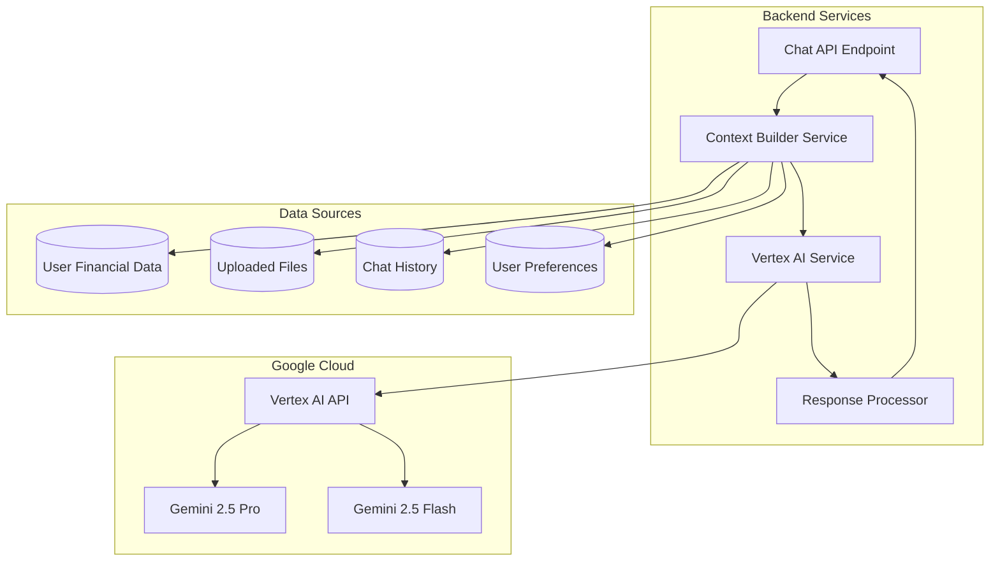

# Vertex AI Integration Specification

## Overview
Detailed specification for integrating Google Cloud Vertex AI with Gemini models into the financial dashboard for intelligent financial insights, recommendations, and document analysis.

## Architecture



## Model Selection Strategy

### Gemini 2.5 Pro
**Use for:**
- Complex financial analysis
- Multi-step reasoning
- Document analysis and extraction
- Investment recommendations
- Tax optimization strategies
- Budget planning with projections

**Configuration:**
```typescript
const PRO_CONFIG = {
  model: 'gemini-2.5-pro',
  temperature: 0.3,  // Lower for factual financial advice
  maxOutputTokens: 8192,
  topP: 0.8,
  topK: 40
}
```

### Gemini 2.5 Flash
**Use for:**
- Quick financial queries
- Simple categorization
- Transaction descriptions
- Basic spending insights
- Fast responses for chat

**Configuration:**
```typescript
const FLASH_CONFIG = {
  model: 'gemini-2.5-flash',
  temperature: 0.4,
  maxOutputTokens: 4096,
  topP: 0.9,
  topK: 40
}
```

### Model Selection Logic
```typescript
function selectModel(queryType: QueryType, complexity: number): ModelConfig {
  if (complexity > 0.7 || queryType === 'analysis' || queryType === 'document') {
    return PRO_CONFIG
  }
  return FLASH_CONFIG
}
```

## Context Building System

### Context Builder Service
```typescript
interface FinancialContext {
  userProfile: UserProfile
  accounts: Account[]
  recentTransactions: Transaction[]
  budgets: Budget[]
  investments: Investment[]
  invoices: Invoice[]
  uploadedDocuments: UploadedFile[]
  chatHistory: Message[]
  userPreferences: UserPreferences
  financialSummary: FinancialSummary
}

interface FinancialSummary {
  totalBalance: number
  monthlyIncome: number
  monthlyExpenses: number
  savingsRate: number
  budgetAdherence: number
  investmentPerformance: number
}
```

### Context Building Strategy

#### 1. Data Prioritization (Token Budget Management)
```typescript
const TOKEN_BUDGET = 30000 // Reserve for response

interface ContextPriority {
  userProfile: 100,        // Always include
  financialSummary: 95,    // Always include
  recentTransactions: 80,  // Last 30 days
  budgets: 70,             // Current period
  accounts: 60,            // Current balances
  investments: 50,         // If user has investments
  chatHistory: 40,         // Last 10 messages
  uploadedDocuments: 30,   // Relevant documents only
  invoices: 20             // Recent invoices
}
```

#### 2. Context Building Algorithm
```typescript
async function buildContext(
  userId: string,
  query: string,
  queryType: QueryType
): Promise<FinancialContext> {
  const budget = TOKEN_BUDGET
  const context: Partial<FinancialContext> = {}
  
  // Always include user profile and summary
  context.userProfile = await getUserProfile(userId)
  context.financialSummary = await calculateFinancialSummary(userId)
  
  // Add data based on query type and available budget
  if (queryType === 'spending' || queryType === 'budget') {
    context.recentTransactions = await getRecentTransactions(userId, 30)
    context.budgets = await getCurrentBudgets(userId)
  }
  
  if (queryType === 'investment') {
    context.investments = await getInvestments(userId)
  }
  
  if (queryType === 'document') {
    context.uploadedDocuments = await getRelevantDocuments(userId, query)
  }
  
  // Add chat history for continuity
  context.chatHistory = await getRecentMessages(userId, 10)
  
  return context as FinancialContext
}
```

#### 3. Context Formatting for Gemini
```typescript
function formatContextForGemini(context: FinancialContext): string {
  return `
## User Profile
- Name: ${context.userProfile.name}
- Company: ${context.userProfile.company_name}
- Currency: ${context.userProfile.preferences.currency}

## Financial Summary
- Total Balance: ${formatCurrency(context.financialSummary.totalBalance)}
- Monthly Income: ${formatCurrency(context.financialSummary.monthlyIncome)}
- Monthly Expenses: ${formatCurrency(context.financialSummary.monthlyExpenses)}
- Savings Rate: ${context.financialSummary.savingsRate}%

## Accounts
${context.accounts.map(acc => `
- ${acc.name} (${acc.type}): ${formatCurrency(acc.balance)} ${acc.currency}
`).join('')}

## Recent Transactions (Last 30 Days)
${context.recentTransactions.slice(0, 20).map(tx => `
- ${tx.transaction_date}: ${tx.description} - ${formatCurrency(tx.amount)} (${tx.category?.name || 'Uncategorized'})
`).join('')}

## Active Budgets
${context.budgets.map(budget => `
- ${budget.category?.name}: ${formatCurrency(budget.amount)} budgeted
`).join('')}

## Investments
${context.investments.map(inv => `
- ${inv.name} (${inv.symbol}): ${inv.quantity} units @ ${formatCurrency(inv.current_price)}
`).join('')}

## Recent Chat History
${context.chatHistory.map(msg => `
${msg.role}: ${msg.content}
`).join('')}
`
}
```

## Prompt Engineering

### System Prompt Template
```typescript
const SYSTEM_PROMPT = `You are an expert financial advisor AI assistant for a personalized financial dashboard. Your role is to help users understand their finances, provide actionable insights, and support better financial decision-making.

## Your Capabilities
- Analyze spending patterns and trends
- Provide budget optimization recommendations
- Offer investment insights and suggestions
- Help with tax planning and optimization
- Analyze uploaded financial documents
- Answer questions about financial data
- Create financial projections and forecasts

## Guidelines
1. Always base recommendations on the user's actual financial data
2. Be specific and actionable in your advice
3. Consider the user's financial goals and preferences
4. Explain your reasoning clearly
5. Highlight both opportunities and risks
6. Use the user's preferred currency for all amounts
7. Be conservative with investment advice - emphasize diversification
8. For tax advice, recommend consulting a professional for complex situations
9. Never make up financial data - only use provided context
10. If you need more information, ask clarifying questions

## Response Format
- Use clear, concise language
- Structure complex advice with bullet points or numbered lists
- Include specific numbers and percentages when relevant
- Provide actionable next steps
- Use markdown formatting for readability

## Important Notes
- You have access to the user's complete financial profile
- All monetary amounts are in the user's preferred currency unless specified
- Historical data is available for trend analysis
- User preferences and goals are considered in recommendations
`
```

### Query-Specific Prompt Templates

#### Spending Analysis
```typescript
const SPENDING_ANALYSIS_PROMPT = `
Analyze the user's spending patterns based on their recent transactions and budgets.

Focus on:
1. Top spending categories and trends
2. Budget adherence and overspending areas
3. Unusual or recurring large expenses
4. Opportunities for cost reduction
5. Comparison to previous periods

Provide specific, actionable recommendations for optimizing spending.
`
```

#### Investment Recommendations
```typescript
const INVESTMENT_PROMPT = `
Provide investment insights based on the user's current portfolio and financial situation.

Consider:
1. Current asset allocation and diversification
2. Risk tolerance based on age and financial goals
3. Portfolio performance vs. benchmarks
4. Rebalancing opportunities
5. Tax-efficient investment strategies

Always emphasize:
- Diversification importance
- Long-term perspective
- Risk management
- Professional advice for major decisions
`
```

#### Budget Optimization
```typescript
const BUDGET_OPTIMIZATION_PROMPT = `
Help the user optimize their budget based on their spending patterns and financial goals.

Analyze:
1. Current budget vs. actual spending
2. Categories with consistent overspending
3. Opportunities to reallocate funds
4. Savings potential
5. Goal alignment

Provide:
- Specific budget adjustments
- Spending reduction strategies
- Savings targets
- Timeline for improvements
`
```

#### Document Analysis
```typescript
const DOCUMENT_ANALYSIS_PROMPT = `
Analyze the uploaded financial document and extract relevant insights.

Tasks:
1. Identify document type (bank statement, invoice, tax document, etc.)
2. Extract key financial data
3. Categorize transactions if applicable
4. Identify important dates and deadlines
5. Highlight notable items or anomalies

Provide:
- Summary of key information
- Extracted data in structured format
- Action items or deadlines
- Integration with user's financial data
`
```

## Vertex AI Service Implementation

### Service Structure
```typescript
// server/src/services/vertex-ai.ts

import { PredictionServiceClient } from '@google-cloud/aiplatform'
import { buildContext, formatContextForGemini } from './context-builder'
import { selectModel, getModelConfig } from './model-selector'
import { parseResponse, validateResponse } from './response-processor'

export class VertexAIService {
  private client: PredictionServiceClient
  private projectId: string
  private location: string
  
  constructor() {
    this.client = new PredictionServiceClient({
      projectId: process.env.GOOGLE_CLOUD_PROJECT,
      location: process.env.GOOGLE_CLOUD_LOCATION,
      keyFilename: process.env.GOOGLE_APPLICATION_CREDENTIALS
    })
    this.projectId = process.env.GOOGLE_CLOUD_PROJECT!
    this.location = process.env.GOOGLE_CLOUD_LOCATION!
  }
  
  async generateResponse(
    userId: string,
    query: string,
    queryType: QueryType,
    sessionId?: string
  ): Promise<AIResponse> {
    try {
      // Build context
      const context = await buildContext(userId, query, queryType)
      const formattedContext = formatContextForGemini(context)
      
      // Select model
      const complexity = this.assessQueryComplexity(query, queryType)
      const modelConfig = selectModel(queryType, complexity)
      
      // Build prompt
      const prompt = this.buildPrompt(query, formattedContext, queryType)
      
      // Call Vertex AI
      const response = await this.callVertexAI(prompt, modelConfig)
      
      // Process and validate response
      const processedResponse = await parseResponse(response)
      const validatedResponse = await validateResponse(processedResponse, context)
      
      // Store for learning
      await this.storeInteraction(userId, query, validatedResponse, sessionId)
      
      return validatedResponse
    } catch (error) {
      return this.handleError(error, query)
    }
  }
  
  private assessQueryComplexity(query: string, queryType: QueryType): number {
    let complexity = 0.5
    
    // Increase complexity for analysis queries
    if (queryType === 'analysis' || queryType === 'document') {
      complexity += 0.3
    }
    
    // Increase for longer queries
    if (query.length > 200) {
      complexity += 0.1
    }
    
    // Increase for multi-part questions
    if (query.includes('and') || query.includes('also')) {
      complexity += 0.1
    }
    
    return Math.min(complexity, 1.0)
  }
  
  private buildPrompt(
    query: string,
    context: string,
    queryType: QueryType
  ): string {
    const systemPrompt = SYSTEM_PROMPT
    const queryPrompt = this.getQueryPrompt(queryType)
    
    return `${systemPrompt}

## User's Financial Context
${context}

## Query Type: ${queryType}
${queryPrompt}

## User's Question
${query}

## Your Response
`
  }
  
  private async callVertexAI(
    prompt: string,
    config: ModelConfig
  ): Promise<string> {
    const endpoint = `projects/${this.projectId}/locations/${this.location}/publishers/google/models/${config.model}`
    
    const request = {
      endpoint,
      instances: [{ content: prompt }],
      parameters: {
        temperature: config.temperature,
        maxOutputTokens: config.maxOutputTokens,
        topP: config.topP,
        topK: config.topK
      }
    }
    
    const [response] = await this.client.predict(request)
    return response.predictions[0].content
  }
  
  private handleError(error: any, query: string): AIResponse {
    console.error('Vertex AI Error:', error)
    
    return {
      content: "I'm sorry, I encountered an error processing your request. Please try again or rephrase your question.",
      type: 'error',
      suggestions: [
        'Try asking a simpler question',
        'Check if your financial data is up to date',
        'Contact support if the issue persists'
      ]
    }
  }
}
```

## Response Processing

### Response Schema
```typescript
interface AIResponse {
  content: string
  type: 'insight' | 'recommendation' | 'analysis' | 'error' | 'question'
  confidence: number
  data?: {
    transactions?: Transaction[]
    categories?: Category[]
    projections?: Projection[]
    recommendations?: Recommendation[]
  }
  suggestions?: string[]
  followUpQuestions?: string[]
  metadata?: {
    modelUsed: string
    tokensUsed: number
    processingTime: number
  }
}
```

### Response Parser
```typescript
async function parseResponse(rawResponse: string): Promise<AIResponse> {
  // Extract structured data if present
  const dataMatch = rawResponse.match(/```json\n([\s\S]*?)\n```/)
  let data = null
  
  if (dataMatch) {
    try {
      data = JSON.parse(dataMatch[1])
    } catch (e) {
      console.warn('Failed to parse structured data from response')
    }
  }
  
  // Determine response type
  const type = detectResponseType(rawResponse)
  
  // Extract suggestions
  const suggestions = extractSuggestions(rawResponse)
  
  // Extract follow-up questions
  const followUpQuestions = extractFollowUpQuestions(rawResponse)
  
  return {
    content: rawResponse,
    type,
    confidence: calculateConfidence(rawResponse),
    data,
    suggestions,
    followUpQuestions
  }
}
```

## Error Handling & Fallbacks

### Error Types
```typescript
enum AIErrorType {
  RATE_LIMIT = 'RATE_LIMIT',
  TOKEN_LIMIT = 'TOKEN_LIMIT',
  MODEL_ERROR = 'MODEL_ERROR',
  CONTEXT_ERROR = 'CONTEXT_ERROR',
  NETWORK_ERROR = 'NETWORK_ERROR'
}
```

### Fallback Strategy
```typescript
async function handleAIError(
  error: AIErrorType,
  query: string,
  context: FinancialContext
): Promise<AIResponse> {
  switch (error) {
    case AIErrorType.RATE_LIMIT:
      return {
        content: "I'm currently experiencing high demand. Please try again in a moment.",
        type: 'error',
        suggestions: ['Wait 30 seconds and try again', 'Try a simpler question']
      }
    
    case AIErrorType.TOKEN_LIMIT:
      // Reduce context and retry
      const reducedContext = reduceContext(context)
      return await retryWithReducedContext(query, reducedContext)
    
    case AIErrorType.MODEL_ERROR:
      // Try alternative model
      return await retryWithAlternativeModel(query, context)
    
    default:
      return {
        content: "I encountered an unexpected error. Please try again.",
        type: 'error'
      }
  }
}
```

## Learning & Personalization

### User Preference Tracking
```typescript
interface UserFinancialPreferences {
  riskTolerance: 'conservative' | 'moderate' | 'aggressive'
  investmentGoals: string[]
  savingsTarget: number
  budgetStrictness: 'flexible' | 'moderate' | 'strict'
  preferredCategories: string[]
  notificationPreferences: NotificationPreferences
}
```

### Feedback Loop
```typescript
async function storeInteraction(
  userId: string,
  query: string,
  response: AIResponse,
  sessionId?: string
): Promise<void> {
  await supabase.from('ai_interactions').insert({
    user_id: userId,
    session_id: sessionId,
    query,
    response: response.content,
    response_type: response.type,
    confidence: response.confidence,
    model_used: response.metadata?.modelUsed,
    tokens_used: response.metadata?.tokensUsed,
    created_at: new Date().toISOString()
  })
}

async function recordFeedback(
  interactionId: string,
  feedback: 'helpful' | 'not_helpful' | 'partially_helpful',
  comments?: string
): Promise<void> {
  await supabase.from('ai_feedback').insert({
    interaction_id: interactionId,
    feedback,
    comments,
    created_at: new Date().toISOString()
  })
}
```

## Cost Management

### Token Usage Tracking
```typescript
interface TokenUsage {
  userId: string
  date: string
  promptTokens: number
  responseTokens: number
  totalTokens: number
  cost: number
}

async function trackTokenUsage(
  userId: string,
  promptTokens: number,
  responseTokens: number,
  model: string
): Promise<void> {
  const cost = calculateCost(promptTokens, responseTokens, model)
  
  await supabase.from('token_usage').upsert({
    user_id: userId,
    date: new Date().toISOString().split('T')[0],
    prompt_tokens: promptTokens,
    response_tokens: responseTokens,
    total_tokens: promptTokens + responseTokens,
    cost
  })
}

function calculateCost(
  promptTokens: number,
  responseTokens: number,
  model: string
): number {
  // Gemini 2.5 Pro pricing (example)
  const pricing = {
    'gemini-2.5-pro': { prompt: 0.00125, response: 0.00375 },
    'gemini-2.5-flash': { prompt: 0.00025, response: 0.0005 }
  }
  
  const rates = pricing[model] || pricing['gemini-2.5-flash']
  return (promptTokens * rates.prompt + responseTokens * rates.response) / 1000
}
```

### Rate Limiting
```typescript
const RATE_LIMITS = {
  free: { requestsPerMinute: 10, tokensPerDay: 50000 },
  basic: { requestsPerMinute: 30, tokensPerDay: 200000 },
  premium: { requestsPerMinute: 100, tokensPerDay: 1000000 }
}

async function checkRateLimit(userId: string): Promise<boolean> {
  const user = await getUser(userId)
  const limits = RATE_LIMITS[user.tier]
  
  const usage = await getTodayUsage(userId)
  
  if (usage.tokens >= limits.tokensPerDay) {
    throw new AIError(AIErrorType.RATE_LIMIT, 'Daily token limit exceeded')
  }
  
  return true
}
```

## Security Considerations

### Data Privacy
1. **No PII in Logs**: Mask sensitive data in logs
2. **Context Isolation**: Each user's context is completely isolated
3. **Data Retention**: AI interactions stored for 90 days, then archived
4. **Access Control**: Only authenticated users can access AI features

### Prompt Injection Prevention
```typescript
function sanitizeUserInput(input: string): string {
  // Remove potential injection attempts
  const sanitized = input
    .replace(/```/g, '')
    .replace(/system:/gi, '')
    .replace(/assistant:/gi, '')
    .replace(/user:/gi, '')
  
  // Limit length
  return sanitized.slice(0, 2000)
}
```

## Testing Strategy

### Unit Tests
- Context building logic
- Model selection algorithm
- Response parsing
- Error handling

### Integration Tests
- Vertex AI API calls
- Database interactions
- End-to-end chat flow

### AI Response Tests
- Response quality validation
- Factual accuracy checks
- Consistency testing
- Edge case handling

## Monitoring & Metrics

### Key Metrics
- Response time (p50, p95, p99)
- Token usage per user
- Error rate by type
- User satisfaction (feedback scores)
- Cost per query

### Alerts
- High error rate (>5%)
- Slow response time (>5s)
- Token usage spike
- Cost threshold exceeded

---

**Status**: Draft
**Last Updated**: 2026-03-22
**Next Review**: Before implementation begins

## Overview
Detailed specification for integrating Google Cloud Vertex AI with Gemini models into the financial dashboard for intelligent financial insights, recommendations, and document analysis.

## Architecture


## Model Selection Strategy

### Gemini 2.5 Pro
**Use for:**
- Complex financial analysis
- Multi-step reasoning
- Document analysis and extraction
- Investment recommendations
- Tax optimization strategies
- Budget planning with projections

**Configuration:**
```typescript
const PRO_CONFIG = {
  model: 'gemini-2.5-pro',
  temperature: 0.3,  // Lower for factual financial advice
  maxOutputTokens: 8192,
  topP: 0.8,
  topK: 40
}
```

### Gemini 2.5 Flash
**Use for:**
- Quick financial queries
- Simple categorization
- Transaction descriptions
- Basic spending insights
- Fast responses for chat

**Configuration:**
```typescript
const FLASH_CONFIG = {
  model: 'gemini-2.5-flash',
  temperature: 0.4,
  maxOutputTokens: 4096,
  topP: 0.9,
  topK: 40
}
```

### Model Selection Logic
```typescript
function selectModel(queryType: QueryType, complexity: number): ModelConfig {
  if (complexity > 0.7 || queryType === 'analysis' || queryType === 'document') {
    return PRO_CONFIG
  }
  return FLASH_CONFIG
}
```

## Context Building System

### Context Builder Service
```typescript
interface FinancialContext {
  userProfile: UserProfile
  accounts: Account[]
  recentTransactions: Transaction[]
  budgets: Budget[]
  investments: Investment[]
  invoices: Invoice[]
  uploadedDocuments: UploadedFile[]
  chatHistory: Message[]
  userPreferences: UserPreferences
  financialSummary: FinancialSummary
}

interface FinancialSummary {
  totalBalance: number
  monthlyIncome: number
  monthlyExpenses: number
  savingsRate: number
  budgetAdherence: number
  investmentPerformance: number
}
```

### Context Building Strategy

#### 1. Data Prioritization (Token Budget Management)
```typescript
const TOKEN_BUDGET = 30000 // Reserve for response

interface ContextPriority {
  userProfile: 100,        // Always include
  financialSummary: 95,    // Always include
  recentTransactions: 80,  // Last 30 days
  budgets: 70,             // Current period
  accounts: 60,            // Current balances
  investments: 50,         // If user has investments
  chatHistory: 40,         // Last 10 messages
  uploadedDocuments: 30,   // Relevant documents only
  invoices: 20             // Recent invoices
}
```

#### 2. Context Building Algorithm
```typescript
async function buildContext(
  userId: string,
  query: string,
  queryType: QueryType
): Promise<FinancialContext> {
  const budget = TOKEN_BUDGET
  const context: Partial<FinancialContext> = {}
  
  // Always include user profile and summary
  context.userProfile = await getUserProfile(userId)
  context.financialSummary = await calculateFinancialSummary(userId)
  
  // Add data based on query type and available budget
  if (queryType === 'spending' || queryType === 'budget') {
    context.recentTransactions = await getRecentTransactions(userId, 30)
    context.budgets = await getCurrentBudgets(userId)
  }
  
  if (queryType === 'investment') {
    context.investments = await getInvestments(userId)
  }
  
  if (queryType === 'document') {
    context.uploadedDocuments = await getRelevantDocuments(userId, query)
  }
  
  // Add chat history for continuity
  context.chatHistory = await getRecentMessages(userId, 10)
  
  return context as FinancialContext
}
```

#### 3. Context Formatting for Gemini
```typescript
function formatContextForGemini(context: FinancialContext): string {
  return `
## User Profile
- Name: ${context.userProfile.name}
- Company: ${context.userProfile.company_name}
- Currency: ${context.userProfile.preferences.currency}

## Financial Summary
- Total Balance: ${formatCurrency(context.financialSummary.totalBalance)}
- Monthly Income: ${formatCurrency(context.financialSummary.monthlyIncome)}
- Monthly Expenses: ${formatCurrency(context.financialSummary.monthlyExpenses)}
- Savings Rate: ${context.financialSummary.savingsRate}%

## Accounts
${context.accounts.map(acc => `
- ${acc.name} (${acc.type}): ${formatCurrency(acc.balance)} ${acc.currency}
`).join('')}

## Recent Transactions (Last 30 Days)
${context.recentTransactions.slice(0, 20).map(tx => `
- ${tx.transaction_date}: ${tx.description} - ${formatCurrency(tx.amount)} (${tx.category?.name || 'Uncategorized'})
`).join('')}

## Active Budgets
${context.budgets.map(budget => `
- ${budget.category?.name}: ${formatCurrency(budget.amount)} budgeted
`).join('')}

## Investments
${context.investments.map(inv => `
- ${inv.name} (${inv.symbol}): ${inv.quantity} units @ ${formatCurrency(inv.current_price)}
`).join('')}

## Recent Chat History
${context.chatHistory.map(msg => `
${msg.role}: ${msg.content}
`).join('')}
`
}
```

## Prompt Engineering

### System Prompt Template
```typescript
const SYSTEM_PROMPT = `You are an expert financial advisor AI assistant for a personalized financial dashboard. Your role is to help users understand their finances, provide actionable insights, and support better financial decision-making.

## Your Capabilities
- Analyze spending patterns and trends
- Provide budget optimization recommendations
- Offer investment insights and suggestions
- Help with tax planning and optimization
- Analyze uploaded financial documents
- Answer questions about financial data
- Create financial projections and forecasts

## Guidelines
1. Always base recommendations on the user's actual financial data
2. Be specific and actionable in your advice
3. Consider the user's financial goals and preferences
4. Explain your reasoning clearly
5. Highlight both opportunities and risks
6. Use the user's preferred currency for all amounts
7. Be conservative with investment advice - emphasize diversification
8. For tax advice, recommend consulting a professional for complex situations
9. Never make up financial data - only use provided context
10. If you need more information, ask clarifying questions

## Response Format
- Use clear, concise language
- Structure complex advice with bullet points or numbered lists
- Include specific numbers and percentages when relevant
- Provide actionable next steps
- Use markdown formatting for readability

## Important Notes
- You have access to the user's complete financial profile
- All monetary amounts are in the user's preferred currency unless specified
- Historical data is available for trend analysis
- User preferences and goals are considered in recommendations
`
```

### Query-Specific Prompt Templates

#### Spending Analysis
```typescript
const SPENDING_ANALYSIS_PROMPT = `
Analyze the user's spending patterns based on their recent transactions and budgets.

Focus on:
1. Top spending categories and trends
2. Budget adherence and overspending areas
3. Unusual or recurring large expenses
4. Opportunities for cost reduction
5. Comparison to previous periods

Provide specific, actionable recommendations for optimizing spending.
`
```

#### Investment Recommendations
```typescript
const INVESTMENT_PROMPT = `
Provide investment insights based on the user's current portfolio and financial situation.

Consider:
1. Current asset allocation and diversification
2. Risk tolerance based on age and financial goals
3. Portfolio performance vs. benchmarks
4. Rebalancing opportunities
5. Tax-efficient investment strategies

Always emphasize:
- Diversification importance
- Long-term perspective
- Risk management
- Professional advice for major decisions
`
```

#### Budget Optimization
```typescript
const BUDGET_OPTIMIZATION_PROMPT = `
Help the user optimize their budget based on their spending patterns and financial goals.

Analyze:
1. Current budget vs. actual spending
2. Categories with consistent overspending
3. Opportunities to reallocate funds
4. Savings potential
5. Goal alignment

Provide:
- Specific budget adjustments
- Spending reduction strategies
- Savings targets
- Timeline for improvements
`
```

#### Document Analysis
```typescript
const DOCUMENT_ANALYSIS_PROMPT = `
Analyze the uploaded financial document and extract relevant insights.

Tasks:
1. Identify document type (bank statement, invoice, tax document, etc.)
2. Extract key financial data
3. Categorize transactions if applicable
4. Identify important dates and deadlines
5. Highlight notable items or anomalies

Provide:
- Summary of key information
- Extracted data in structured format
- Action items or deadlines
- Integration with user's financial data
`
```

## Vertex AI Service Implementation

### Service Structure
```typescript
// server/src/services/vertex-ai.ts

import { PredictionServiceClient } from '@google-cloud/aiplatform'
import { buildContext, formatContextForGemini } from './context-builder'
import { selectModel, getModelConfig } from './model-selector'
import { parseResponse, validateResponse } from './response-processor'

export class VertexAIService {
  private client: PredictionServiceClient
  private projectId: string
  private location: string
  
  constructor() {
    this.client = new PredictionServiceClient({
      projectId: process.env.GOOGLE_CLOUD_PROJECT,
      location: process.env.GOOGLE_CLOUD_LOCATION,
      keyFilename: process.env.GOOGLE_APPLICATION_CREDENTIALS
    })
    this.projectId = process.env.GOOGLE_CLOUD_PROJECT!
    this.location = process.env.GOOGLE_CLOUD_LOCATION!
  }
  
  async generateResponse(
    userId: string,
    query: string,
    queryType: QueryType,
    sessionId?: string
  ): Promise<AIResponse> {
    try {
      // Build context
      const context = await buildContext(userId, query, queryType)
      const formattedContext = formatContextForGemini(context)
      
      // Select model
      const complexity = this.assessQueryComplexity(query, queryType)
      const modelConfig = selectModel(queryType, complexity)
      
      // Build prompt
      const prompt = this.buildPrompt(query, formattedContext, queryType)
      
      // Call Vertex AI
      const response = await this.callVertexAI(prompt, modelConfig)
      
      // Process and validate response
      const processedResponse = await parseResponse(response)
      const validatedResponse = await validateResponse(processedResponse, context)
      
      // Store for learning
      await this.storeInteraction(userId, query, validatedResponse, sessionId)
      
      return validatedResponse
    } catch (error) {
      return this.handleError(error, query)
    }
  }
  
  private assessQueryComplexity(query: string, queryType: QueryType): number {
    let complexity = 0.5
    
    // Increase complexity for analysis queries
    if (queryType === 'analysis' || queryType === 'document') {
      complexity += 0.3
    }
    
    // Increase for longer queries
    if (query.length > 200) {
      complexity += 0.1
    }
    
    // Increase for multi-part questions
    if (query.includes('and') || query.includes('also')) {
      complexity += 0.1
    }
    
    return Math.min(complexity, 1.0)
  }
  
  private buildPrompt(
    query: string,
    context: string,
    queryType: QueryType
  ): string {
    const systemPrompt = SYSTEM_PROMPT
    const queryPrompt = this.getQueryPrompt(queryType)
    
    return `${systemPrompt}

## User's Financial Context
${context}

## Query Type: ${queryType}
${queryPrompt}

## User's Question
${query}

## Your Response
`
  }
  
  private async callVertexAI(
    prompt: string,
    config: ModelConfig
  ): Promise<string> {
    const endpoint = `projects/${this.projectId}/locations/${this.location}/publishers/google/models/${config.model}`
    
    const request = {
      endpoint,
      instances: [{ content: prompt }],
      parameters: {
        temperature: config.temperature,
        maxOutputTokens: config.maxOutputTokens,
        topP: config.topP,
        topK: config.topK
      }
    }
    
    const [response] = await this.client.predict(request)
    return response.predictions[0].content
  }
  
  private handleError(error: any, query: string): AIResponse {
    console.error('Vertex AI Error:', error)
    
    return {
      content: "I'm sorry, I encountered an error processing your request. Please try again or rephrase your question.",
      type: 'error',
      suggestions: [
        'Try asking a simpler question',
        'Check if your financial data is up to date',
        'Contact support if the issue persists'
      ]
    }
  }
}
```

## Response Processing

### Response Schema
```typescript
interface AIResponse {
  content: string
  type: 'insight' | 'recommendation' | 'analysis' | 'error' | 'question'
  confidence: number
  data?: {
    transactions?: Transaction[]
    categories?: Category[]
    projections?: Projection[]
    recommendations?: Recommendation[]
  }
  suggestions?: string[]
  followUpQuestions?: string[]
  metadata?: {
    modelUsed: string
    tokensUsed: number
    processingTime: number
  }
}
```

### Response Parser
```typescript
async function parseResponse(rawResponse: string): Promise<AIResponse> {
  // Extract structured data if present
  const dataMatch = rawResponse.match(/```json\n([\s\S]*?)\n```/)
  let data = null
  
  if (dataMatch) {
    try {
      data = JSON.parse(dataMatch[1])
    } catch (e) {
      console.warn('Failed to parse structured data from response')
    }
  }
  
  // Determine response type
  const type = detectResponseType(rawResponse)
  
  // Extract suggestions
  const suggestions = extractSuggestions(rawResponse)
  
  // Extract follow-up questions
  const followUpQuestions = extractFollowUpQuestions(rawResponse)
  
  return {
    content: rawResponse,
    type,
    confidence: calculateConfidence(rawResponse),
    data,
    suggestions,
    followUpQuestions
  }
}
```

## Error Handling & Fallbacks

### Error Types
```typescript
enum AIErrorType {
  RATE_LIMIT = 'RATE_LIMIT',
  TOKEN_LIMIT = 'TOKEN_LIMIT',
  MODEL_ERROR = 'MODEL_ERROR',
  CONTEXT_ERROR = 'CONTEXT_ERROR',
  NETWORK_ERROR = 'NETWORK_ERROR'
}
```

### Fallback Strategy
```typescript
async function handleAIError(
  error: AIErrorType,
  query: string,
  context: FinancialContext
): Promise<AIResponse> {
  switch (error) {
    case AIErrorType.RATE_LIMIT:
      return {
        content: "I'm currently experiencing high demand. Please try again in a moment.",
        type: 'error',
        suggestions: ['Wait 30 seconds and try again', 'Try a simpler question']
      }
    
    case AIErrorType.TOKEN_LIMIT:
      // Reduce context and retry
      const reducedContext = reduceContext(context)
      return await retryWithReducedContext(query, reducedContext)
    
    case AIErrorType.MODEL_ERROR:
      // Try alternative model
      return await retryWithAlternativeModel(query, context)
    
    default:
      return {
        content: "I encountered an unexpected error. Please try again.",
        type: 'error'
      }
  }
}
```

## Learning & Personalization

### User Preference Tracking
```typescript
interface UserFinancialPreferences {
  riskTolerance: 'conservative' | 'moderate' | 'aggressive'
  investmentGoals: string[]
  savingsTarget: number
  budgetStrictness: 'flexible' | 'moderate' | 'strict'
  preferredCategories: string[]
  notificationPreferences: NotificationPreferences
}
```

### Feedback Loop
```typescript
async function storeInteraction(
  userId: string,
  query: string,
  response: AIResponse,
  sessionId?: string
): Promise<void> {
  await supabase.from('ai_interactions').insert({
    user_id: userId,
    session_id: sessionId,
    query,
    response: response.content,
    response_type: response.type,
    confidence: response.confidence,
    model_used: response.metadata?.modelUsed,
    tokens_used: response.metadata?.tokensUsed,
    created_at: new Date().toISOString()
  })
}

async function recordFeedback(
  interactionId: string,
  feedback: 'helpful' | 'not_helpful' | 'partially_helpful',
  comments?: string
): Promise<void> {
  await supabase.from('ai_feedback').insert({
    interaction_id: interactionId,
    feedback,
    comments,
    created_at: new Date().toISOString()
  })
}
```

## Cost Management

### Token Usage Tracking
```typescript
interface TokenUsage {
  userId: string
  date: string
  promptTokens: number
  responseTokens: number
  totalTokens: number
  cost: number
}

async function trackTokenUsage(
  userId: string,
  promptTokens: number,
  responseTokens: number,
  model: string
): Promise<void> {
  const cost = calculateCost(promptTokens, responseTokens, model)
  
  await supabase.from('token_usage').upsert({
    user_id: userId,
    date: new Date().toISOString().split('T')[0],
    prompt_tokens: promptTokens,
    response_tokens: responseTokens,
    total_tokens: promptTokens + responseTokens,
    cost
  })
}

function calculateCost(
  promptTokens: number,
  responseTokens: number,
  model: string
): number {
  // Gemini 2.5 Pro pricing (example)
  const pricing = {
    'gemini-2.5-pro': { prompt: 0.00125, response: 0.00375 },
    'gemini-2.5-flash': { prompt: 0.00025, response: 0.0005 }
  }
  
  const rates = pricing[model] || pricing['gemini-2.5-flash']
  return (promptTokens * rates.prompt + responseTokens * rates.response) / 1000
}
```

### Rate Limiting
```typescript
const RATE_LIMITS = {
  free: { requestsPerMinute: 10, tokensPerDay: 50000 },
  basic: { requestsPerMinute: 30, tokensPerDay: 200000 },
  premium: { requestsPerMinute: 100, tokensPerDay: 1000000 }
}

async function checkRateLimit(userId: string): Promise<boolean> {
  const user = await getUser(userId)
  const limits = RATE_LIMITS[user.tier]
  
  const usage = await getTodayUsage(userId)
  
  if (usage.tokens >= limits.tokensPerDay) {
    throw new AIError(AIErrorType.RATE_LIMIT, 'Daily token limit exceeded')
  }
  
  return true
}
```

## Security Considerations

### Data Privacy
1. **No PII in Logs**: Mask sensitive data in logs
2. **Context Isolation**: Each user's context is completely isolated
3. **Data Retention**: AI interactions stored for 90 days, then archived
4. **Access Control**: Only authenticated users can access AI features

### Prompt Injection Prevention
```typescript
function sanitizeUserInput(input: string): string {
  // Remove potential injection attempts
  const sanitized = input
    .replace(/```/g, '')
    .replace(/system:/gi, '')
    .replace(/assistant:/gi, '')
    .replace(/user:/gi, '')
  
  // Limit length
  return sanitized.slice(0, 2000)
}
```

## Testing Strategy

### Unit Tests
- Context building logic
- Model selection algorithm
- Response parsing
- Error handling

### Integration Tests
- Vertex AI API calls
- Database interactions
- End-to-end chat flow

### AI Response Tests
- Response quality validation
- Factual accuracy checks
- Consistency testing
- Edge case handling

## Monitoring & Metrics

### Key Metrics
- Response time (p50, p95, p99)
- Token usage per user
- Error rate by type
- User satisfaction (feedback scores)
- Cost per query

### Alerts
- High error rate (>5%)
- Slow response time (>5s)
- Token usage spike
- Cost threshold exceeded

---

**Status**: Draft
**Last Updated**: 2026-03-22
**Next Review**: Before implementation begins

